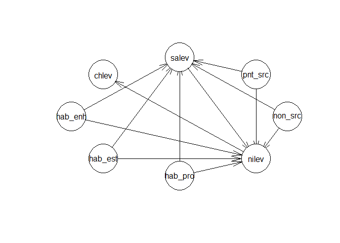
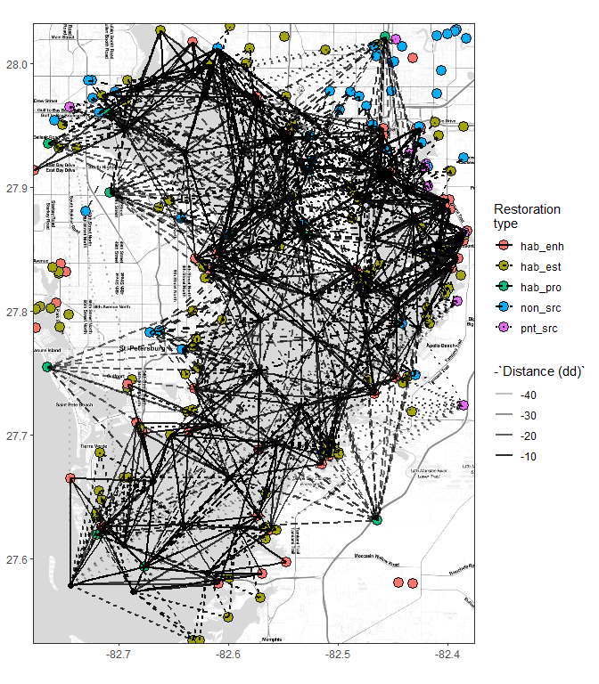
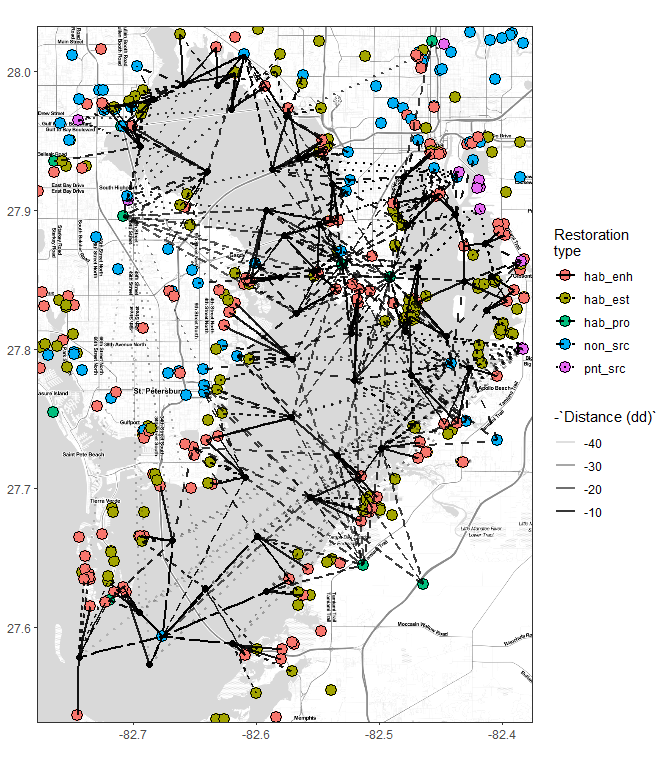

  
# Evaluation of full model

Matched to nearest ten sites in each category, +/- five years

```r
knitr::opts_chunk$set(message = F, warning = F)

library(tidyverse)
library(ggmap)
library(lubridate)
library(geosphere)
library(stringi)
library(tibble)
library(sf)
library(sp)
library(rgdal)
library(foreach)
library(doParallel)
library(bnlearn)
library(scales)

data(restdat)
data(reststat)
data(wqdat)
data(wqstat)
data(tbpoly)
data(allchg)

# source R files
source('R/get_chg.R')
source('R/get_clo.R')
source('R/get_cdt.R')
source('R/get_brk.R')
source('R/get_fin.R')
source('R/get_all.R')
source('R/rnd_dat.R')

# base map
ext <- make_bbox(reststat$lon, reststat$lat, f = 0.1)
map <- get_stamenmap(ext, zoom = 10, maptype = "toner-lite")
pbase <- ggmap(map) +
  theme_bw() +
  theme(
    axis.title.x = element_blank(),
    axis.title.y = element_blank()
  )

## run conditional probability functions
wqvar1 <- 'sal'
wqvar2 <- 'tn'
wqvar3 <- 'chla'
mtch <- 10
yrdf <- 5
resgrp <- 'type' 
qts <- c(0.33, 0.66)
lbs1 <- c('sal_lo', 'sal_md', 'sal_hi')
lbs2 <- c('tn_lo', 'tn_md', 'tn_hi')

data(restdat)
data(reststat)
data(wqdat)
data(wqstat)
data(tbpoly)
data(allchg)

# get sub data, restoration sites
restdat <- restdat %>% 
  mutate(
    type = factor(type, 
                  levels = c('HABITAT_ENHANCEMENT', 'HABITAT_ESTABLISHMENT', 'HABITAT_PROTECTION', 'NONPOINT_SOURCE', 'POINT_SOURCE'),
                  labels = c('hab_enh', 'hab_est', 'hab_pro', 'non_src', 'pnt_src')
    )
  )

## Distance to restoration sites
wqmtch <- get_clo(restdat, reststat, wqstat, resgrp = resgrp, mtch = mtch)

## Summarizing effects of restoration projects on salinity
sachg <- get_chg(wqdat, wqmtch, statdat, restdat, wqvar = wqvar1, yrdf = yrdf) %>% 
  rename(saval = cval)

## Summarizing effects of restoration projects on tn
tnchg <- get_chg(wqdat, wqmtch, statdat, restdat, wqvar = wqvar2, yrdf = yrdf) %>% 
  rename(nival = cval)

## Summarizing effects of restoration projects on chl
chchg <- get_chg(wqdat, wqmtch, statdat, restdat, wqvar = wqvar3, yrdf = yrdf) %>% 
  rename(chval = cval)

# combine all using a super simple approach
cdat <- sachg %>% 
  left_join(tnchg, by = c('stat', 'hab_enh', 'hab_est', 'hab_pro', 'non_src', 'pnt_src')) %>% 
  left_join(chchg, by = c('stat', 'hab_enh', 'hab_est', 'hab_pro', 'non_src', 'pnt_src')) %>% 
  mutate(
    salev = cut(saval, breaks = c(-Inf, quantile(saval, qts, na.rm = T), Inf), labels = c('lo', 'md', 'hi')),
    nilev = cut(nival, breaks = c(-Inf, quantile(nival, qts, na.rm = T), Inf), labels = c('lo', 'md', 'hi')),
    chlev = cut(chval, breaks = c(-Inf, quantile(chval, qts, na.rm = T), Inf), labels = c('lo', 'md', 'hi'))
  ) %>% 
  # dplyr::select(-saval, -nival, -chval, -stat) %>% 
  mutate_if(is.character, factor) %>% 
  data.frame
```

## Habitat and water projects by type {.tabset}

### salinity and nitrogen


```r
toplo <- cdat %>% 
  group_by(hab_enh, hab_est, hab_pro, non_src, pnt_src, salev) %>% 
  summarize(
    nivalmd = mean(nival, na.rm = T)
    ) %>% 
  na.omit %>% 
  unite('rest', hab_enh, hab_est, hab_pro, non_src, pnt_src, sep = ', ')

# plot
ggplot(toplo, aes(x = rest, y = nivalmd)) + 
  theme_bw() + 
  theme(
    axis.title.y = element_blank()
  ) +
  geom_bar(stat = 'identity') +
  facet_wrap(~ salev, ncol = 1) + 
  coord_flip() +
  scale_y_continuous('TN')
```

<!-- -->

### nitrogen and chlorophyll


```r
toplo <- cdat %>% 
  group_by(hab_enh, hab_est, hab_pro, non_src, pnt_src, nilev) %>% 
  summarize(
    chvalmd = mean(chval, na.rm = T)
    ) %>% 
  na.omit %>% 
  unite('rest', hab_enh, hab_est, hab_pro, non_src, pnt_src, sep = ', ')
  
# plot
ggplot(toplo, aes(x = rest, y = chvalmd)) + 
  theme_bw() + 
  theme(
    axis.title.y = element_blank()
  ) +
  geom_bar(stat = 'identity') +
  facet_wrap(~ nilev, ncol = 1) + 
  coord_flip() +
  scale_y_continuous('Chlorophyll')
```

<!-- -->

## Bayesian network model


```r
bncdat <- cdat %>% 
  dplyr::select(-saval, -nival, -chval, -stat) %>% 
  na.omit

net <- model2network("[hab_enh][hab_est][hab_pro][non_src][pnt_src][salev|hab_enh:hab_est:hab_pro:non_src:pnt_src][nilev|salev:hab_enh:hab_est:hab_pro:non_src:pnt_src][chlev|nilev]")

mat <- amat(net)
fittedBN <- bn.fit(net, data = bncdat)
plot(net)
```

<!-- -->


```r
# get conditional probabilities of lo/md/hi chl for bef/aft of each project type
ests <- bncdat %>% 
  dplyr::select(-salev, -nilev) %>% 
  mutate_if(is.factor, as.character) %>% 
  gather('project', 'event', -chlev) %>% 
  unique %>% 
  mutate(est = NA)

for(i in 1:nrow(ests)){
  
  toest <- ests[i, ]
  est <- paste0('cpquery(fittedBN, event = (chlev == toest$chlev), evidence = (', toest$project, ' == "', toest$event, '"))')
  est <- eval(parse(text = est))
  ests[i, 'est'] <- est
  
}

# format for plot
ests <- ests %>% 
  mutate(event = gsub('^hab\\_enh\\_|^hab\\_est\\_|^hab\\_pro\\_|^non\\_src\\_|^pnt\\_src\\_', '', event)) %>% 
  mutate(chlev = factor(chlev, levels = c('lo', 'md', 'hi'))) %>% 
  spread(event, est) %>% 
  mutate(
    chg = 100 * (aft - bef),
    chg = round(chg, 1)
    )

ggplot(ests, aes(x = chlev, y = project, fill = chg)) +
  geom_tile(colour = 'black') +
  geom_text(aes(label = chg, size = abs(chg))) +
  scale_size(guide = F) +
  theme_bw(base_family = 'serif') +
  scale_x_discrete('Chlorophyll', expand = c(0, 0)) + 
  scale_y_discrete('Restoration project', expand = c(0, 0)) +
  scale_fill_gradient2('% change', low = muted("red"), mid = "white", high = muted("blue"), midpoint = 0)
```

<!-- -->

## Distance to restoration sites {.tabset}


```r
wqmtch <- get_clo(restdat, reststat, wqstat, resgrp = 'type', mtch = mtch)
```

### Closest 

```r
## 
# plots

# combine lat/lon for the plot
toplo <- wqmtch %>% 
  left_join(wqstat, by = 'stat') %>% 
  left_join(reststat, by = 'id') %>% 
  rename(
    `Restoration\ntype` = resgrp,
    `Distance (dd)` = dist
  )
    
# restoration project grouping column
resgrp <- 'type'
restall <- left_join(restdat, reststat, by = 'id')
names(restall)[names(restall) %in% resgrp] <- 'Restoration\ntype'

# extent
ext <- make_bbox(wqstat$lon, wqstat$lat, f = 0.1)
map <- get_stamenmap(ext, zoom = 12, maptype = "toner-lite")

# base map
pbase <- ggmap(map) +
  theme_bw() +
  theme(
    axis.title.x = element_blank(),
    axis.title.y = element_blank()
  ) +
  geom_point(data = restall, aes(x = lon, y = lat, fill = `Restoration\ntype`), size = 4, pch = 21) +
  geom_point(data = wqstat, aes(x = lon, y = lat), size = 2)

# closest
toplo1 <- filter(toplo, rnk %in% 1)

pbase + 
  geom_segment(data = toplo1, aes(x = lon.x, y = lat.x, xend = lon.y, yend = lat.y, alpha = -`Distance (dd)`, linetype = `Restoration\ntype`), size = 1)
```

<!-- -->

### Closest three

```r
# closest five percent
# fvper <- max(toplo$rnk) %>% 
#   `*`(0.2) %>% 
#   ceiling
toplo2 <- filter(toplo, rnk %in% c(1:3))

pbase + 
  geom_segment(data = toplo2, aes(x = lon.x, y = lat.x, xend = lon.y, yend = lat.y, alpha = -`Distance (dd)`, linetype = `Restoration\ntype`), size = 1)
```

<!-- -->

### Closest all

```r
# closest all combo
toplo3 <- toplo

pbase + 
  geom_segment(data = toplo3, aes(x = lon.x, y = lat.x, xend = lon.y, yend = lat.y, alpha = -`Distance (dd)`, linetype = `Restoration\ntype`), size = 1)
```

<!-- -->
