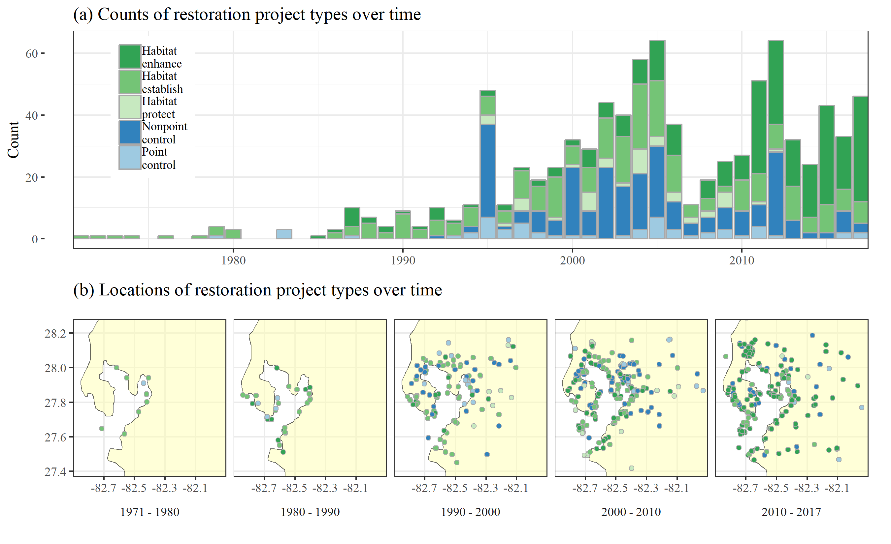
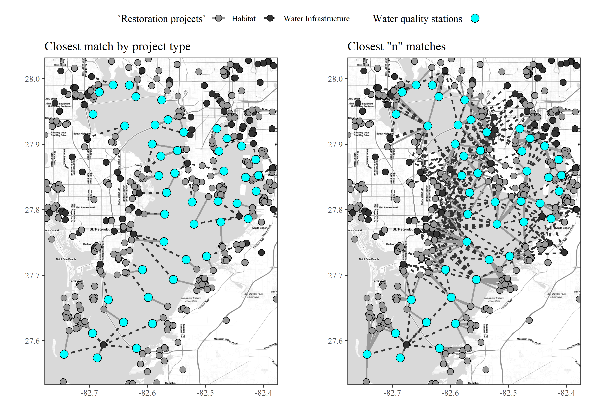
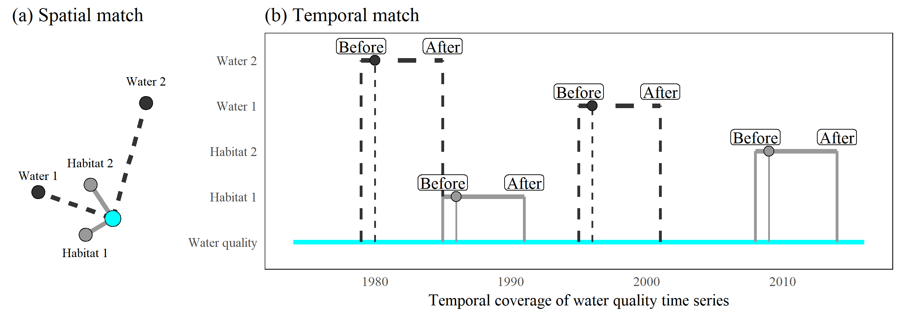
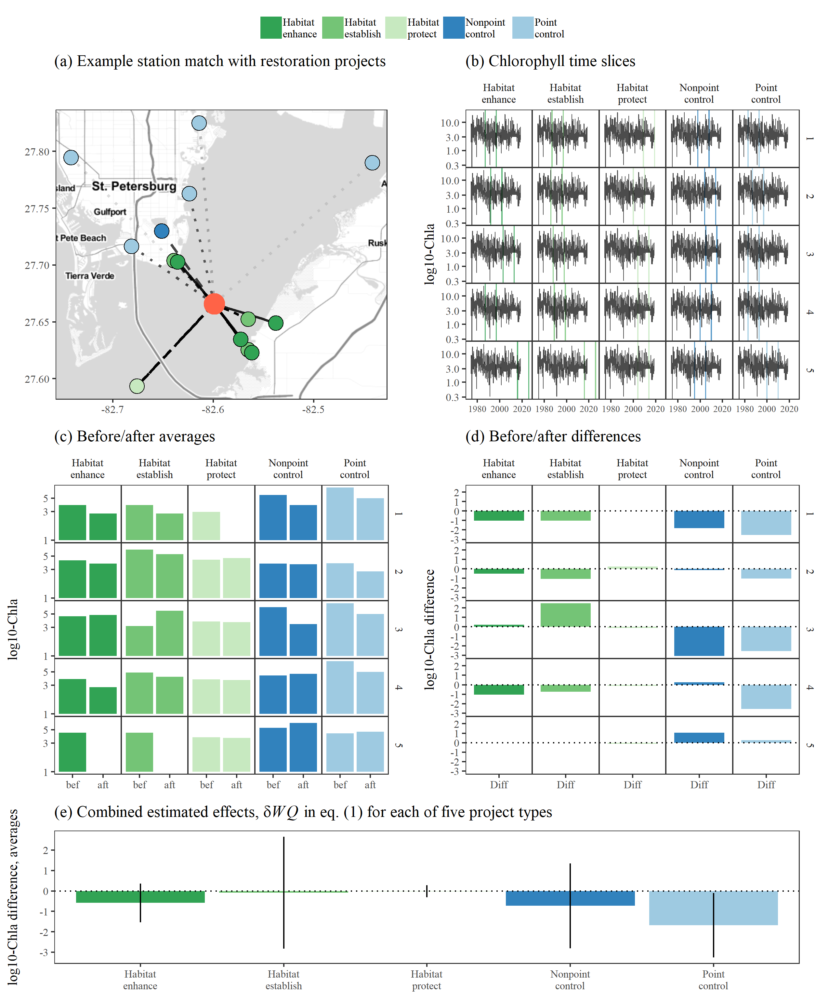
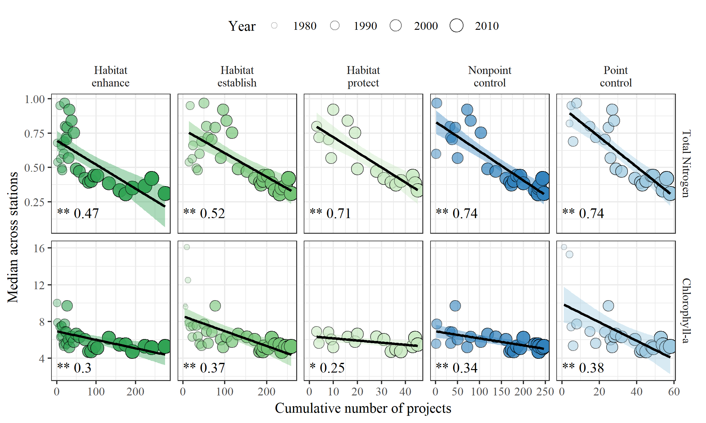
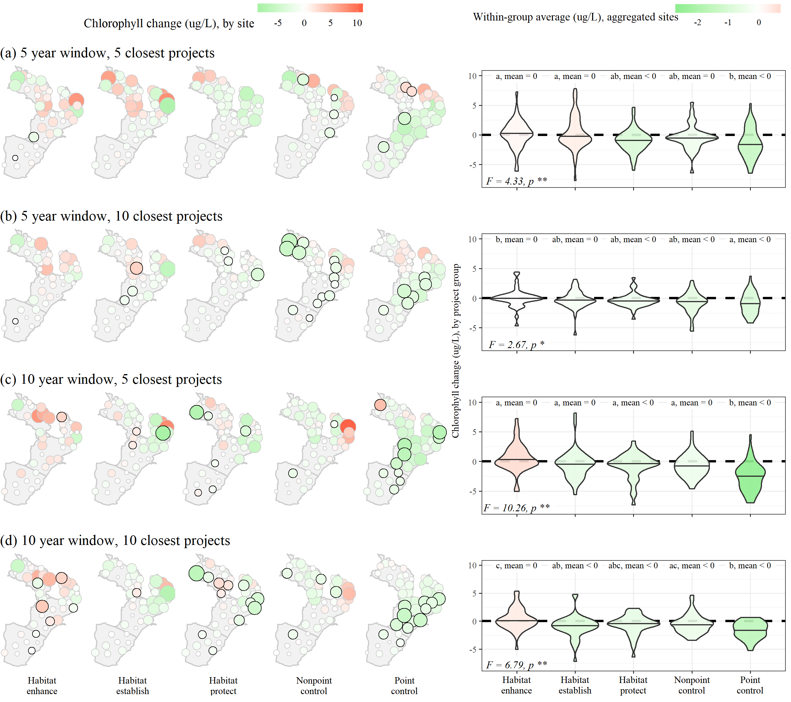

Marcus W. Beck ([marcusb@sccwrp.org](mailto:marcusb@sccwrp.org)), Southern California Coastal Water Research Project, Costa Mesa, CA

Edward T. Sherwood ([esherwood@tbep.org](mailto:esherwood@tbep.org)), Tampa Bay Estuary Program, St. Petersburg, FL

Jessica Renee Henkel ([jessica.henkel@restorethegulf.gov](mailto:jessica.henkel@restorethegulf.gov)), Gulf Coast Ecosystem Restoration Council, New Orleans, LA

Kirsten Dorans ([kdorans@tulane.edu](mailto:kdorans@tulane.edu)), Tulane University School of Public Health and Tropical Medicine, New Orleans, LA

Kathryn Ireland ([kathryn.b.ireland@gmail.com](mailto:kathryn.b.ireland@gmail.com)), Montana State University, Bozeman, MT

Patricia Varela ([pvarela@geosyntec.com](mailto:pvarela@geosyntec.com)), Geosyntec Consultants Inc., Houston, TX

```{r echo = F}
# get current bib file
refs <- httr::GET('https://raw.githubusercontent.com/fawda123/refs/master/refs.bib')
refs <- rawToChar(refs$content)
writeLines(refs, con = file('refs.bib'))
```

```{r setup, echo = F, warning = F, message = F, results = 'hide'}
# figure path, chunk options
knitr::opts_chunk$set(fig.path = 'figs/', warning = F, message = F, echo = F, cache = T, dev.args = list(family = 'serif'), out.width = '100%', cache.path = 'manu_draft_cache/')

# libraries
library(ggmap)
library(tidyverse)
library(geosphere)
library(stringi)
library(scales)
library(tibble)
library(vegan)
library(sf)
library(sp)
library(gridExtra)
library(ggrepel)
library(lubridate)
library(forcats)
library(Hmisc)
library(multcompView)
library(patchwork)
library(grid)
library(gridExtra)
library(flextable)
library(officer)

# functions
source('../R/funcs.R')
source('../R/get_chgdf.R')
source('../R/get_clo.R')
source('../R/get_dat.R')
source('../R/get_lik.R')

# # spatial match for figs
# mtch <- 10
# wqmtch <- get_clo(restdat, reststat, wqstat, resgrp = 'top', mtch = mtch)
# save(wqmtch, file = '../data/wqmtch.RData', compress = 'xz')

load(file = '../data/restdat.RData')
load(file = '../data/reststat.RData')
load(file = '../data/wqstat.RData')
load(file = '../data/wqdat.RData')
load(file = '../data/wqmtch.RData')
load(file = '../data/grdavemanu.RData')
load(file = '../data/tb_seg.RData')
load(file = '../data/rndsims.RData')

# restoration project type levels, labels and colors
typelev <- c('hab_enh', 'hab_est', 'hab_pro', 'non_src', 'pnt_src')
typelab <- c('Habitat\nenhance', 'Habitat\nestablish', 'Habitat\nprotect', 'Nonpoint\ncontrol', 'Point\ncontrol')
typecol <- c('#31a354', '#74c476' , '#c7e9c0', '#3182bd', '#9ecae1')
```

```{r spellcheck, echo = F, cache = F, eval = F}
spelling::spell_check_files('manuscript/manu_draft.Rmd')
```

```{r echo = F, cache = F}
raw <- system('git log -1', intern = TRUE)
raw <- raw[grep('^Date', raw)]
raw <- paste('Version', raw)
```
`r raw`

# Abstract

Habitat and water quality restoration projects are commonly used to enhance coastal resources or mitigate negative impacts of water quality stressors.  Significant resources have been expended for restoration projects, yet much less attention has focused on evaluating broad regional outcomes beyond site-specific assessments.  This study presents an empirical framework to evaluate multiple datasets in the Tampa Bay area (Florida, USA) to identify 1) the types of restoration projects that have produced the greatest improvements in water quality, and 2) over which time frames different projects may produce water quality benefits.  Information on the location and date of completion of 887 restoration projects from 1971 to 2017 were spatially and temporally matched with water quality records at each of 45 long-term monitoring stations in Tampa Bay.  The underlying assumption was that the developed framework could identify differences in water quality changes between types of restoration projects based on aggregate estimates of chlorophyll-a concentrations before and after the completion of one to many projects.  Water infrastructure projects to control point source nutrient loading into the Bay were associated with the highest likelihood of chlorophyll-a reduction, particularly for projects occurring prior to 1995.  Habitat restoration projects were also associated with reductions in chlorophyll-a, although the likelihood of reductions from the cumulative effects of these projects were less than those from infrastructure improvements alone.  The framework is sufficiently flexible for application to different spatiotemporal contexts and could be used to develop reasonable expectations for implementation of future water quality restoration activities throughout the Gulf of Mexico.

Key words: chlorophyll, long-term monitoring, restoration, Tampa Bay, trends

# Introduction

Despite considerable investments over the last four decades in coastal and estuarine ecosystem restoration [@Diefenderfer16], numerous challenges still impede comprehensive success. In the Gulf of Mexico (GOM), chronic and discrete drivers contribute to the difficulty in restoring and managing coastal ecosystems. For example, the synergistic effects of widespread coastal urbanization and climate change impacts will likely limit future habitat management effectiveness in the southeast United States [@Enwright16]. Competing management and policy directives for flood protection, national commerce, and energy development complicate and prolong efforts to abate coastal hypoxia and other coastal water quality issues [@Rabotyagov14;@Alfredo17]. Disputes surrounding fair and equitable natural resource allocation often result in contentious implementation plans for the long-term sustainability of coastal resources [@GMFMC17]. Further, discrete tropical storm [@Greening06b] and large-scale pollution events [@Beyer16] often reset, reverse or delay progress in restoring coastal ecosystems. These factors contribute to a complex setting for successful implementation of ecosystem restoration activities within the GOM.

In addition to these challenges, the difficulties of rigorously monitoring and understanding an ecosystem’s condition and restoration trajectory at various spatial and temporal scales can further constrain evaluations of restoration success [@Hobbs01;@Liang19]. The lack of long-term environmental monitoring is a primary impediment to understanding pre- versus post- restoration change [@Schiff16] and also impedes recognition of any coastal ecosystem improvements derived from prolonged management, policy and restoration activities. Long-term coastal monitoring programs can facilitate a broader sense of how management, policy and restoration activities affect coastal ecosystem quality [@Borja16]. Utilizing lessons-learned from environmental monitoring programs, new frameworks are starting to emerge to better understand and facilitate coastal restoration ecology [@Bayraktarov16;@Diefenderfer16].

A very large, comprehensive and concerted effort to restore Gulf of Mexico coastal ecosystems is currently underway [@GCERC13;@GCERC16]. Primary funding for this effort is derived from the legal settlements resulting from the 2010 Deepwater Horizon oil spill. Funding sources include: early restoration investments that were made immediately following the spill, natural resource damage assessments resulting from the spill’s impacts [@NRDA16], a record legal settlement of civil and criminal penalties negotiated between the responsible parties and the US government with strict US congressional oversight ([United States vs. BPXP, et. al.](http://www.laed.uscourts.gov/sites/default/files/OilSpill/4042016ConsentDecree_0.pdf)), and matching funds from research, monitoring and restoration practitioners worldwide. These funds, equating to >$20B US, present the Gulf of Mexico community an unprecedented opportunity to revitalize regional restoration efforts that will span multiple generations [@GCERC13;@GCERC16]. Consequently, the restoration investments being made with these funds will be highly scrutinized. Better understanding the environmental outcomes of past restoration investments will help identify how, where and when future resources should be invested so that the Gulf Coast community can achieve the highest degree of restoration success.
 
Tampa Bay (Florida, USA) is the second largest estuarine embayment in the GOM and improvement in condition over the last four decades is one of the most exceptional success stories for coastal water quality management [@Greening06;@Greening14].  Most notably, seagrass coverage in 2016 was reported as 16,857 hectares baywide, surpassing the goal of restoring coverage to 95% that occurred in 1950 [@Sherwood17]. Reductions in nutrient loading [@Poe05;@Greening14], chlorophyll-a concentrations [@Wang99;@Beck15], and improvements in water clarity [@Morrison06;@Beck18g] have also preceded the seagrass recovery. Most of these positive changes have resulted from management efforts to reduce point source controls on nutrient pollution in the highly developed areas of Hillsborough Bay [@Johansson91;@Johansson92]. These controls allowed nutrient and chlorophyll-a targets to be met by the early 1990s.  However, numerous smaller projects, including watershed-focused efforts [@Lewis98], may have had a supporting role in maintaining the earlier water quality improvements observed after water infrastructure upgrades. The cumulative effects of over 900 restoration projects, relative to broad watershed-scale management efforts, are not well understood. Understanding how implementation of these projects is associated with adjacent estuarine water quality at various spatio-temporal scales will provide an improved understanding of the link between overall estuary improvements and specific restoration activities.  

Demonstrating success for restoration activities is challenging for several reasons [@Ruiz05;@Wortley13].  Success may be vaguely or even subjectively defined because the effects of restoration could be described in different ways depending on project goals [@Zedler07].  For example, site-specific measures of before/after condition are commonly used measures of success, whereas downstream effects may be more important to consider for baywide conditions [@Diefenderfer11]. More importantly, quantifying success as a measure of environmental improvements is challenged by the variety of factors that affect water quality across space and time.  New tools are needed that can address these challenges to help guide and support GOM restoration. Here, we present an empirical framework for evaluating the influence of restoration projects on water quality improvements within Tampa Bay. The framework helps synthesize routine, ambient monitoring data across various spatio-temporal scales to demonstrate how coastal restoration activities cumulatively affect estuarine water quality improvement. Data on water quality and restoration projects in the Tampa Bay area were used to demonstrate application of the analysis framework. Water quality and restoration datasets were evaluated to identify: 1) the types of restoration activities that most improve water quality, and 2) the time frames over which water quality benefits resulting from restoration may be resolved.  Changes in chlorophyll-a concentrations, a proxy for negative eutrophication effects within Tampa Bay [@Greening14], were used as the success metric to evaluate estuarine restoration activities. 

# Methods

## Study area

Tampa Bay is located on the west-central GOM coast of the Florida peninsula. Its watershed is among the most highly developed regions in Florida (Figure \@ref(fig:map)).  More than 60 percent of land-use within 15 km of the Bay shoreline is urban or suburban [@SWFWMD18].  The Bay has been a focal point of economic activity since the 1950s and currently supports a mix of industrial, private, and recreational activities.  The watershed includes one of the largest phosphate production regions in the country, which is supported by port operations primarily in the northeast portion of the Bay [@Greening14].  

Current water quality in Tampa Bay is dramatically improved from the degraded historical condition. Nitrogen loads into the Bay in the mid-1970s have been estimated as 8.9 x $10^6$ kg/y, largely from wastewater effluent [@Greening14]. In addition to reduced aesthetics, hypereutrophic environmental conditions were common and included elevated chlorophyll-a and harmful algae, and reduced bottom water dissolved oxygen, water clarity, and seagrass coverage. Nekton abundance were depressed for both commercial and recreational species during this time, although emergent tidal wetland loss and fisheries practices (i.e., widespread Bay trawling and gill-netting) likely also contributed to declines [@Comp85;@Lombardo85].  
 
A long-term monitoring program in Tampa Bay has been instrumental in assessing and tracking restoration efforts.  In the early 1970s, the initial baywide ambient monitoring program was established by a local environmental leader (Roger Stewart), which was subsequently institutionalized through State legislation by the creation of the Environmental Protection Commission of Hillsborough County. This occurred largely in response to citizen out-cry of the Bay’s deteriorating ecology [@Greening14]. Ongoing local support for this program has remained since 1972, and other local, municipal governments have created complementary water quality monitoring programs, all of which now support water quality assessments and management efforts spear-headed by the Tampa Bay Estuary Program [@Sherwood16]. Some of the key attributes supporting the maintenance of this long-term monitoring program are summarized in @Schiff16 and @Gross17.  

Nearly 900 public and private projects to improve water quality have also been completed in Tampa Bay and its watershed over the past 4 decades.  These projects represent numerous voluntary (e.g., coastal habitat acquisition, restoration, preservation, etc.) and compliance-driven (e.g., stormwater retrofits, process water treatment upgrades, site-level permitting, power plant scrubber upgrades, improved agricultural practices, residential fertilizer use ordinances, etc.) activities.  Linking data from the long-term monitoring program with data on these projects will provide an understanding of how the cumulative effects of small-scale restoration have contributed to water quality relative to the historical water infrastructure upgrades.   

## Data sources

Several databases were combined to document restoration projects in Tampa Bay and its watershed. Each database was unique and no overlap in documented projects was observed.  Data from the Tampa Bay Water Atlas (version 2.3, [http://maps.wateratlas.usf.edu/tampabay/](http://maps.wateratlas.usf.edu/tampabay/), @TBEP17) documented 253 projects from 1971 to 2007 that were primarily focused on habitat establishment, enhancement, or protection along the Bay's immediate shoreline or within the larger watershed area.  Examples include restoration of salt marshes and mangroves, exotic vegetation control, and conversion of agricultural lands to natural habitats. Information on an additional 265 recent (2008-2017) projects was acquired from the US EPA's National Estuary Program Mapper ([https://gispub2.epa.gov/NEPmap/](https://gispub2.epa.gov/NEPmap/)). This database provides only basic information, such as year of completion, geographic coordinates, general activities, and areal coverage.  Data from the TBEP Action Plan Database Portal ([https://apdb.tbeptech.org/index.php](https://apdb.tbeptech.org/index.php)) documented locations of infrastructure improvement projects, structural best management practices, and policy-driven stormwater or wastewater management actions. This database included 368 projects from 1992 to 2016 for county, municipal or industrial activities, such as implementation of best management practices at treatment plants, creation of stormwater retention or treatment controls, or site-specific controls of industrial and municipal point sources. 

For all restoration datasets, shared information included the project location, year of completion, and classification of the restoration activity. We developed and applied a two-level classification scheme that described each restoration project as 1) a habitat or water infrastructure improvement and 2) more specifically as enhancement, establishment, or protection for habitat or as nonpoint or point source controls for water infrastructure.  These categories were used to provide a broad characterization of restoration activities that were considered to contribute to improvements in water quality over time. The final combined dataset included `r nrow(restdat)` projects from 1971 to 2017 (Figure \@ref(fig:restyrs)).  Projects with incomplete information were not included in the final dataset.
 
Water quality data in Tampa Bay have been collected consistently since 1974 by the Environmental Protection Commission of Hillsborough County [@Sherwood16;@TBEP17].  Data were collected monthly at forty-five stations using a water sample or monitoring sonde at bottom, mid- or surface depths, depending on parameter.  The locations of monitoring stations were fixed and cover the entire Bay from the uppermost mesohaline sections to the lowermost euhaline portions that have direct interaction with the GOM (Figure \@ref(fig:map)). Mid-depth water samples at each station are laboratory processed immediately after collection.  Chlorophyll-a ($\mu$g/L) measurements at each site were used for analysis, totaling approximately 515 observations for each station.

## Data synthesis and analysis framework

The five sub-categories for each project (habitat enhancement, establishment, and protection; nonpoint and point source controls) were separately evaluated to describe the likelihood of changes in water quality associated with each type.  Water quality monitoring sites were matched to the closest selected restoration projects and changes in the water quality data were evaluated relative to the completion dates of the selected projects.  Spatial and temporal matching can be accomplished using several methods that vary in complexity.  For example, hydrologic distances or other non-Euclidean distance weightings by watershed topology can be used to link measurements to modelled locations in space [@Curriero06;@Gardner11].  However, we adopted a relatively simple approach with limited data requirements to maximize potential applications in other regions (e.g., no hydrology data are needed, only spatial location).  The matchings began with a spatial join wherein the Euclidean distances between each water quality station and each restoration project were quantified.  The restoration projects closest to each water quality station were identified using the distances between projects and water quality stations.  The distances were also grouped by the five restoration project types (i.e., habitat protection, nonpoint source control, etc.) such that the closest $n$ sites of a given project type could be identified for any water quality station (Figure \@ref(fig:spmtch)).  

For each spatial match, temporal matching between water quality stations and restoration projects was obtained by subsetting the water quality data within a time window before and after the completion date of each restoration project (Figure \@ref(fig:tmmtch)).  For the closest $n$ restoration sites for each of five project types, two summarized water quality estimates were obtained to quantify a before and after estimate of chlorophyll-a associated with each project.  The before estimate was the average of observations for the year preceding the completion of a project and the after estimate was the average of observations for a selected window of time (e.g., five years) that occurred after completion of a project. The before estimate for the year prior established the basis of comparison for the water quality estimates in the selected window of time after project completion, where the latter could be manually changed to characterize a potential duration of time within which water quality could improve after project completion. The final two estimates of the before and after values of the five types of restoration projects at each water quality station were based on an average of the $n$ closest restoration sites, weighted inversely by distance from the monitoring station.  Lastly, no data were available on project duration and we assumed that the year associated with each project was generally inclusive of project conception and completion dates. 

 Time windows that overlapped the start and end date of the water quality time series were discarded.  

Change in water quality relative to each type of restoration project was estimated as:

\begin{equation}
\Delta WQ = \frac{\sum_{i = 1}^{n} \hat{wq} \in win + proj_{i, dt}}{n \cdot dist_{i \in n}} - \frac{\sum_{i = 1}^{n} \hat{wq} \in proj_{i, dt} - win}{n \cdot dist_{i \in n}}
(\#eq:wqdif)
\end{equation}

where $\Delta WQ$ was the difference between the after and before averages for each of $n$ spatially  matched restoration projects.  For each $i$ of $n$ projects ($proj$), the average water quality ($\hat{wq}$) within the window ($win$) either before ($proj_{i, dt} - win$) or after ($win + proj_{i, dt}$) the completion date ($dt$) for project $i$ was summed.  The summations of water quality before and after each project were then divided by the total number of $n$ matched projects, multiplied by the distance of the projects from a water quality station ($dist_{i \in n}$). This created a weighted average of the before-after estimates for each project that was inversely related to the distance from a water quality station. A weighted average by distance (or parametric distance weights, @Sickle08) was used based on the assumption that restoration projects farther from a water quality station will have a weaker association with potential changes in chlorophyll-a. The total change in water quality for a project type was simply the difference in weighted averages.  This process was repeated for every station (Figure \@ref(fig:statex)). Overall differences between project types were evaluated by ANOVA F-tests, whereas pairwise differences between project types were evaluated by t-tests with corrected probability values for multiple comparisons.

One of the key assumptions of our approach is that restoration projects will benefit water quality through a reduction in chlorophyll-a.  We make no assumptions about the expected magnitude of an association given that the model does not describe a specific mechanism of change, nor do we make any explicit assumption about the direction of change (i.e., two-tailed tests were used), although a general assumption was that chlorophyll-a would decrease over time in agreement with known changes in water quality.  However, we hypothesized that the magnitude of chlorophyll-a changes varies by project type, and number of projects or length of time window evaluated.  An expected outcome is that explicit, quantitative conclusions can be made about the relative differences between projects types, particularly regarding how more projects of a particular type could benefit water quality and within what general time windows a change might be expected [@Diefenderfer11].

The model was also designed to quantify cumulative relationships of restoration projects with water quality at different spatial scales.  In eqn. \@ref(eq:wqdif), the association of a restoration type with chlorophyll-a is estimated for one water quality station, whereas estimates from several water quality stations can be combined to develop an overall description of a particular restoration type as it applies to an areal unit of interest, potentially over broad regional scales.  For example, estimated associations of point source control projects with each water quality station in the Bay can be combined to develop an overall narrative of how these projects could (assuming a causal relationship) influence environmental change across the entire Bay.  Estimates across stations were evaluated to describe associations in baywide improvements from various restoration project types throughout the watershed.  Estimates were also evaluated by individual Bay segments that have specific management targets for chlorophyll-a concentration [Florida Statute 62-302.532, @Janicki99].  Stratification by Bay segments provided an alternative context for interpreting the results based on areal differences between segments and how restoration projects varied in space and time.  Evaluating the results at different scales can also provide insights into potential stressors (or lack of) and processes controlling the impacts to prioritize management actions by location [@Diefenderfer09;@Thom11].

The analysis of each project type was bounded by two key parameters in eqn. \@ref(eq:wqdif). These include $n$, the number of spatially-matched restoration projects used to average the cumulative estimate of each project type, and $win$, the time windows before and after a project completion date that were used to subset a station's water quality time series. These boundaries affected our ability to characterize each restoration project type with water quality changes. Identifying values that maximized the difference between before and after water quality measurements was necessary to quantify how many projects were most strongly associated with a change in water quality, the time within which a change is expected, and the magnitude of an expected change between project types. We evaluated different combinations of five or ten year time windows from the date of each project completion and the five or ten closest projects to each water quality station. All analyses were conducted with customized scripts created for the R statistical programming language [@RDCT18].

## Testing effects of restoration dates and location

Because of the documented improvements in water quality in Tampa Bay, a concern with our approach is that any association between restoration projects and chlorophyll-a may result from correlations between the two parameters, confounding a true demonstration of water quality improvements in relation to restoration activities.  To address this challenge, estimated changes in chlorophyll-a were evaluated in response to temporal and spatial matching with restoration projects, as above, but with random date and location assignments for each restoration project that were then compared to the actual results.  An expected outcome of randomization is that no differences are observed between project types and that all associations between projects and chlorophyll-a changes should reflect the continuous decline of chlorophyll-a over time, as observed in the independent water quality record. In other words, the randomization creates a null model where the estimated effects of restoration projects would not differ from a simple evaluation of trends in the raw data - slicing the observed time series by random dates and evaluating before/after averages with random projects is expected to reflect the known decline of chlorophyll-a in the raw data.  Alternatively, evidence that our framework provides meaningful results would be supported by differences in chlorophyll-a changes between project types and the timing associated with the changes.   

# Results

## Water quality observations

Chlorophyll-a in Tampa Bay decreased over the forty-year record consistent with documented changes [@Wang99;@Greening14;@Beck15] (Table \@ref(tab:statsum)).  Median concentrations were highest from 1977 to 1987 (median 13.40 $\mu$g/L at low salinity stations <26.5 psu, 7.30 $\mu$g/L at high salinity stations >26.5 psu).  Declines were monotonic throughout the period of record with the largest reductions occurring during the first twenty years (34% decrease), followed by consistent but smaller reductions in concentrations later in the time series. A 34% decrease at low salinity stations and a 30% decrease at high salinity stations was observed between the periods of 1977-1987 to 1987-1997.  Seasonally, chlorophyll-a concentrations were highest in the late summer/early fall periods (median 13.80 $\mu$g/L at low salinity stations, 7.23 $\mu$g/L at high salinity stations, across all years).  Total nitrogen concentrations had similar trends as chlorophyll-a, although a steady decline was observed across the entire time series rather than primarily in the first two decades in contrast to chlorophyll-a [@Poe05;@Greening14].  An exception for total nitrogen was observed at high salinity stations where concentrations were relatively constant at approximately 0.55 mg/L from 1987 to 2007.  Seasonally, total nitrogen concentrations peaked in the late summer/early fall period.

The monotonic decline in chlorophyll-a concentrations was mirrored by increases in the number and types of restoration projects in the watershed, where the number of documented projects especially increased after 2000 (Figure \@ref(fig:restyrs)).  For the entire record, 275 (31% of total) habitat enhancement, 259 (29%) habitat establishment, 45 (5%) habitat protection, 248 (28%) nonpoint source, and 60 (7%) point source control projects were documented.  Individual point source controls early in the record were those that occurred in the historically polluted upper Hillsborough Bay and adjacent to the city of St. Petersburg [@Johansson91;@Johansson92;@Lewis98]. Prior to 1995, only 11 water infrastructure projects (three nonpoint control, eight point source controls) were documented in the database, whereas 70 habitat projects were recorded (50 habitat establishment, 20 habitat enhancement).  Nearly ten times as many restoration projects were completed in 1995 to present (806 total), with notable increases in the number of nonpoint source controls (245) and habitat protection projects (45).   

## Associations between restoration projects and water quality change

Before employing our analytical approach, we evaluated temporal trends in water quality and possible drivers of water quality change to develop an analytical baseline for comparison. A simple analysis of water quality measurements versus the cumulative number of restoration projects over time showed a decrease in both total nitrogen and chlorophyll-a with additional restoration effort.  Analysis of median water quality estimates across all monitoring stations for a given year versus the cumulative number of restoration projects as of that year showed that water quality was related to the number of projects for all project types (based on linear models, $\alpha$ = 0.05; Figure \@ref(fig:cumprj)).  Associations with number of projects were relatively strong for total nitrogen and relatively weaker for chlorophyll-a across project types.  Decreases in total nitrogen were most strongly associated with water infrastructure projects for nonpoint source ($F=65.5, df = 1, 23, p < 0.005$) and point source controls ($F=60.8, df = 1, 21, p < 0.005$), as expected. Habitat protection projects were also strongly associated with decreases in total nitrogen ($F=34.8, df = 1, 14, p < 0.005$).  For chlorophyll-a, the strongest associations were observed with habitat establishment ($F=20.8, df = 1, 35, p< 0.005$) and point source control ($F=13.7, df = 1, 22, p < 0.005$) projects.  A marginally significant association was observed between chlorophyll-a and cumulative habitat protection projects ($F=4.6, df = 1, 14, p = 0.049$).

In contrast to results in Figure \@ref{fig:cumprj}, baywide estimates of the effects of restoration projects using spatial-temporal matching depended on the year window sizes and number of nearby restoration projects matched to each water quality station (Figure \@ref(fig:prjsig)). Estimated associations of different projects types with chlorophyll-a at individual stations are shown in the left maps and the baywide aggregate associations across all stations for a given project type in the right plots. Station points in the left maps correspond to the change estimate for the year window and closest project type selections for each project type that were obtained through the steps in Figure \@ref(fig:statex) and eqn. \@ref(eq:wqdif).  Stations outlined in black have significant results based on t-tests of the mean estimates of chlorophyll-a relative to zero change.  The plots on the right are based on the baywide distributions of the estimated water quality changes for all stations for the corresponding project types in the maps on the left.  The plots on the right also include statistical summaries for 1) an analysis of variance (ANOVA) F-test to compare the distribution of water quality changes between project types, 2) individual t-tests for each project type to evaluate changes that were different from zero, and 3) a multiple comparison test denoted by letters to identify which project types had changes that were different from each other. 

For site-specific estimates of water quality changes, longer time windows and more project matches with each monitoring station increased observations of significant associations (i.e., more black circles in the maps in Figure \@ref(fig:prjsig)d, compared to Figure \@ref(fig:prjsig)a).  This was particularly true for habitat protection projects where no significant associations were observed for the 5 year window, 5 closest projects combination, but twelve stations had significant associations for the 10 year window, 10 closest projects combination. A similar trend was observed for point source control projects where more stations had more significant reductions in chlorophyll-a with the 10 year window, 10 closest projects.  For nonpoint source projects, the greatest number of stations (n = 13) with significant improvements in water quality was observed for the 5 year window, 10 closest projects combination.  Associations of habitat enhancement and habitat establishment projects with water quality stations were inconsistent, with some sites showing an increase or decrease that varied by the year window, closest project combinations. Spatial patterns among stations regarding associations with different project types were also not clear, although point source controls were more commonly associated with improvements in mid-Bay stations (Middle Tampa Bay segment, see Figure \@ref(fig:map)).   

The estimated baywide effects for each project type showed that point source controls were more strongly associated with reductions in chlorophyll-a than the other project types (Figure \@ref(fig:prjsig), right plots).  This association was particularly strong for the ten year window combinations (Figure \@ref(fig:prjsig)c, d), where the results suggested an overall baywide reduction in chlorophyll-a of approximately 2 $\mu$g/L, depending on the number of projects implemented (median change across all sites: reduction of 2.7 $\mu$g/L for 10 years, 5 closest projects and 1.6 $\mu$g/L for 10 years, 10 closest projects). Nonpoint source controls were also significantly associated with chlorophyll-a reductions, but only when a large number of projects were implemented (10 closest project combinations, Figure \@ref(fig:prjsig)b, d).  Additionally, the magnitude of nonpoint source control reductions were less than point source controls (reduction of 0.7 $\mu$g/L for 5 years, 10 closest projects and 0.5 $\mu$g/L for 10 years, 10 closest projects). Habitat protection projects were also significantly associated with baywide changes for all year window, closest project combinations, with the largest estimated reduction of 1$\mu$g/L for the 5 year window, 5 closest projects combination.  Habitat enhancement and establishment projects were not strongly associated with baywide changes in chlorophyll-a, with the exception of habitat establishment for the 10 year window, 10 closest projects combination (0.9 $\mu$g/L reduction).

The above analysis was repeated for individual Bay segments to identify spatial variation in associations of restoration projects with water quality changes.  Table \@ref(tab:prjsigseg) provides similar information as the plots on the right side of Figure \@ref(fig:prjsig), where results are presented similarly but for each of four Bay segments (HB: Hillsborough Bay, LTB: Lower Tampa Bay, MTB: Middle Tampa Bay, OTB: Old Tampa Bay, Figure \@ref(fig:map)) for each year window, closest projects combination. As for the baywide result, point source controls were most consistently associated with reductions in chlorophyll-a, particularly for ten year window combinations.  Nonpoint source controls were also important, although significant associations with chlorophyll-a changes were limited to the Middle and Old Tampa Bay segments. Results for habitat protection projects varied for different Bay segments and year window/closest project combinations, with no clear patterns. Habitat establishment projects were most strongly associated with changes in each Bay segment for the 10 year window, 10 closest projects combination, with the exception of Hillsborough Bay where the relationship was not significant.  Chlorophyll-a changes in Lower Tampa Bay were significantly associated with habitat enhancement and establishment projects for the 5 year window, 10 closest projects combination.

## Effects of random restoration dates and locations

A comparison of the baywide results (Figure \@ref(fig:prjsig), right side) to results from simulations where dates and locations were randomized for each restoration project suggested that the framework in eqn. \@ref(eq:wqdif) is robust.  The same year windows and closest project combinations were evaluated as above (i.e., 5/10 year windows, 5/10 closest projects), but with 1000 simulations where the date and location of each restoration were randomized (i.e., random draw from uniform distribution of years from 1971 to 2017, random draw from uniform distribution of latitude and longitude based on the bounding box of the study area).  Nearly all of the simulated results suggested that each project was associated with a decline in chlorophyll-a (Table \@ref(tab:rndeval), values in bold, mean < 0).  This is consistent with our null hypothesis that randomization would simply reflect the long-term decline in chlorophyll-a that is apparent in the observed water quality records.  Some differences were observed in the 5 years, 5 projects combination where no change (mean = 0) was the most observed outcome from the simulations.  These inconsistencies with our null hypothesis may be the result of using relatively small windows and project combinations, i.e., slicing the data too thin to detect the long-term decline in chlorophyll-a.

The "Actual" and "Agreement" columns in Table \@ref(tab:rndeval) indicate the estimated changes for each project using the actual restoration dates/locations and if the result agrees with those from the random simulations. In support of the alternative hypothesis, nine of the rows in the "Agreement" column indicate a result different than a consistent decline in chlorophyll-a expected under the null hypothesis.  Compared to random simulations, different results were more often observed for habitat enhancement and habitat establishment projects, where the simulated results most often suggested a decrease and the actual results suggested no change in chlorophyll-a.  Nonpoint and point source control projects were in agreement with simulated results, although this does not provide sufficient evidence that the results from the actual data are incorrect.  Because the null hypothesis under randomization suggests projects will be associated with water quality improvements based on the independent chlorophyll-a time series, an observed decline in chlorophyll-a in relation to actual restoration projects could still suggest a signal rather than a false positive result. There is no way of identifying type I errors with the current dataset, although the differences from the null results for habitat enhancement and establishment projects do suggest the framework is robust.

# Discussion

A long-term record of restoration activities and water quality data in Tampa Bay provided the foundation to develop a novel decision support tool for coastal restoration practitioners and managers. Consistent with our objectives, this new tool provided 1) a unique process to understand the associations between past restoration projects and known changes in water quality, and 2) establishes, under certain assumptions, an expectation of water quality improvements that could result from future restoration activities contingent upon the level of investments in different activities and the necessary time to monitor any observed downstream water quality benefits at local to watershed scales. Overall, we demonstrated a baywide association of water quality changes to different restoration activities that varied by project type, while refining parameters for estimating the results, including the spatial context of interpretation. The flexibility of our approach has potentially broad application and extension within the Gulf Coast restoration and management community. 

The results support several conclusions that are consistent with recognized, long-term changes in water quality in Tampa Bay.  Water infrastructure projects related to point and nonpoint source controls were consistently associated with improved water quality.  The record of restoration projects included key point source nutrient controls that occurred primarily in upper Tampa Bay (Hillsborough Bay) and that were successful in reducing nutrient loads during the first two decades of observation [@Johansson91;@Johansson92;@Greening14].  These outcomes were expected and the ability of the results to clearly demonstrate these long-term associations provided a proof of concept for the overall approach. Moreover, efforts focused on mitigating effects of nonpoint sources of pollution were more common in the latter half of record after 1990 and our results provide evidence that these projects have been effective in improving water quality baywide, as well. Nonpoint source control efforts broadly described several activities that included, among others, street sweeping, education/outreach efforts, and various best management practices for stormwater, agricultural, and wetland management programs.  The ability to document effects of nonpoint control efforts on water quality relative to end-of-pipe controls is challenging [@Hassett05;@Meals10;@Liang19] and the results suggest that our approach is capable of detecting improvements in water quality from these projects when many are implemented.   

Habitat restoration projects were also associated with reductions in chlorophyll-a, although to a lesser magnitude than water infrastructure projects. Our categorization of habitat projects as enhancement, establishment, and protection were developed to better understand potential effects on water quality related to the type and intensity of actions for each group.  Specifically, the categories represented extremes from low to high intensity effort, where protection was low effort (e.g., direct land acquisition), establishment was highest effort (e.g., mangrove/seagrass plantings, creation of oyster reefs), and enhancement was moderate effort depending on the activity (e.g., hydrologic restoration for wetlands, exotic species control).  Categorization by effort combined with the associated estimates of water quality improvements provides a coarse evaluation of the tradeoffs associated with each project type.  For example, habitat protection was consistently linked to chlorophyll-a reductions independent of year windows and number of projects.  The effort for land acquisition is minimal relative to the other habitat restoration projects.  Conversely, habitat enhancement was not strongly associated with baywide improvements in water quality and such projects may require more intensive effort and monitoring assessments to understand and contribute towards downstream water quality benefits. Based on these results, habitat protection may be a more immediate and efficient approach than other types of habitat restoration projects, especially if the primary restoration objective is to quickly improve downstream water quality.

Our results also provide an approach to identify an expected range of time and number of projects that are associated with potential improvements in water quality [@Diefenderfer11].  This information was included as an explicit component in eqn. \@ref(eq:wqdif) to quantify tradeoffs for different restoration activities based on how results varied by time and effort, similar to the categorization for habitat projects.  Monitoring water quality improvements after a short period of time since project completion and with fewer projects (e.g., 5 year window, 5 closest projects) may be more efficient than those where improvements are observed after longer periods of time and with more projects (e.g., 10 year window, 10 closest projects), dependent on the project type. Given this logic, both habitat protection and point source controls could potentially provide the greatest measured water quality benefits for the least effort, whereas other projects provide lesser improvements, require more time to confer water quality benefits (e.g., full maturation of a habitat enhancement/establishment site), and require more projects to be implemented to contribute to significant water quality improvements (e.g., implementing many nonpoint source controls across a watershed).  However, this approach assumes that immediate downstream water quality improvements with minimal effort are the primary restoration objectives and implicitly discounts the long-term effects that may or may not persist for a given project type or regional restoration challenges. Protection may also be costly in developed areas with competing land use interests, despite minimal restoration requirements. Likewise, other restoration objectives may be a primary driver for pursuing a particular project type (e.g. increasing biodiversity, improving fish and wildlife habitats, etc.). 

Conclusions from our approach may also be sensitive to system hysteresis.  An initial improvement of water quality associated with a particular project may be obfuscated by chronic degraded conditions, if additional restoration projects that directly address the underlying problem are not pursued [i.e., @Scheffer98;@Borja10].  As an example, habitat enhancement projects were associated with improvements in Lower Tampa Bay only during the five year window when ten projects were implemented; reductions in chlorophyll-a were not shown to persist at the ten year window.

## Assumptions and limitations

There are several assumptions and limitations of our approach that affect the interpretation of the results. These assumptions and limitations are a reflection of 1) the inherent uncertainty in quantifying baywide effects of restoration projects that vary considerably in mechanisms affecting water quality [e.g., @Baird05;@Borja10], and 2) explicit construction of the approach to best account for this uncertainty.  Because we do not know the true effect of restoration projects, the results can be interpreted as worst- or best-case descriptions depending on how much certainty is reflected in the estimates.  At worst, we provide an approach that can identify the closest restoration projects that have occurred near a water quality monitoring site and a means to compare water quality between project types.  We consider this valuable information for managers even if there is considerable uncertainty in the estimates of change; there are currently no tools that match restoration projects to water quality records in Tampa Bay.  At best, we provide a decision support tool that provides managers with an expectation of water quality benefits associated with restorations actions, and an estimate of time required for improvements to be observed [@Diefenderfer11].  Both kinds of information are critical to inform and sustain environmental restoration programs.

The value of our approach to quantify cumulative effects of restoration activities on improving water quality is likely between the worst- and best-case scenarios outlined above given the confidence that can be invested in the conclusions. The ability of our model to support previously and well-described changes in water quality in response to key management interventions [e.g., improvements from point source controls, @Greening14;@Beck15] provides additional assurance and weight of evidence that our approach improves our understanding of restoration effectiveness beyond basic relationships presented in Figure \@ref(fig:cumprj).  The latter was presented specifically to demonstrate limtitations of simpler analysis methods.  For example, the separate effects of habitat establishment and point source projects on chlorophyll-a reductions cannot be separated through simple linear analyses because both increase over time, i.e., an association of chlorophyll-a with one project type could be an artifact of an association with another project type. Likewise, a weak association (e.g., habitat protection and chlorophyll-a) does not provide strong evidence that a particular project type is unimportant for water quality improvements, given that the simple analysis may lack sufficient power to detect an association.  Operating under these constraints, an explanation of how the new approach can guide management is required to minimize extrapolation of conclusions beyond a reasonable level of confidence in what is provided by the results [i.e., a levels-of-evidence reasoning, @Diefenderfer11].  

As an example, a practitioner could use the following logic derived from our approach to guide future restoration efforts. Figure \@ref(fig:prjsig) suggests that point source controls were responsible for an approximate baywide chlorophyll-a reduction of 2 $\mu$g/L.  These results were observed at the 10 year window and 5 (and 10) closest project combinations.  What exactly does this information suggest and what expectations can be derived regarding the likely effects of future point source control efforts? First, an inaccurate conclusion is that baywide chlorophyll-a would be reduced by 2 $\mu$g/L after ten years, if five projects are implemented in the future.  A more correct interpretation is that, historically, the aggregate effect of point source control projects for a "typical" station at any point in the record and location in the Bay has been a reduction of 2 $\mu$g/L after about ten years in response to 5-10 projects, all of which were completed at different times.  Importantly, this latter interpretation assumes causal relationships between the projects and changes in chlorophyll-a. This description is also understandably vague, but it provides context of an expectation relative to other types of projects, particularly in narrative terms.  For example, the aggregate effects of habitat establishment projects were most apparent for the ten year window, ten closest projects combination.  With this information, qualitative conclusions about the relative effects of point source control versus habitat establishment can be made.  Point source control projects are "more effective" in improving downstream water quality because improvements are expected "quicker" and with "fewer" implemented projects, as applied to a "typical" water quality station that could be at any location in the Bay.  Similar but alternative conclusions could be made in different spatial contexts (e.g., "typical" stations in Hillsborough Bay, Table \@ref(tab:prjsigseg)).

The flexibility and simplicity of the approach to quantify associations between restoration projects and water quality was purposeful given the constraints of the data.  Although the compiled restoration databases included additional information on effort (e.g., acreage restored), these data were not consistently collected and our approach was constrained to the most basic information about each project (i.e, type, completion date, and location).  Explicit monitoring of project effectiveness pre- and post-completion is atypical [@Neckles02;@NASEM17] and our minimal dataset describing the when and where for each project is a more available description of restoration efforts across systems, especially in historic contexts. Within these constraints, the model was strictly associative and any conclusions do not provide a mechanistic explanation.  These limitations in our associative approach were apparent in some of the results.  Specifically, significant increases in chlorophyll-a associated with particular projects and year/site combinations were observed (e.g., Figure \@ref(fig:prjsig)d, three sites for habitat enhancement).  These trends are contrary to expectations and highlight shortcomings where the simple design may not have adequately accounted for improvements in downstream water quality (e.g., full ecosystem maturation of a restoration site).  Our aggregated estimates using all stations to describe a baywide association were partly meant to reduce the influence of some of these spurious results. 

The simplicity of our approach also means that it is highly adaptable to novel contexts. A primary goal of this study was to develop a decision support tool that could be applied elsewhere.  We used Tampa Bay as an example where the outcome was partially known and a rich dataset was available, affording us a prior expectation of the results.  Application to additional systems would require, at minimum, water quality observations spanning multiple years and a similar dataset of restoration projects.  Our categorization that described relevant water and habitat related restoration projects was specific to Tampa Bay, but our approach can include different project definitions and specificity depending on the types of activities that may have occurred and the expected benefits for water quality in a different system.  Similarly, the flexibility of our approach to accommodate different year windows and number of projects provides a diagnostic that is sensitive to both the restoration effort expressed in a dataset and how the potential associations could be interpreted.  Lastly, we demonstrated flexibility in the spatial context from estimated changes at discrete locations to entire system-wide responses.  Although there is uncertainty associated with these interpretations (noted above), the ability to accommodate different spatial contexts means the approach can be readily applied to different systems or management questions at various scales - from a single monitoring station to a regional monitoring network. 

## Future directions

Our approach is not without limitations and future research could build on the methods to provide an improved assessment of restoration effectiveness.  Our geospatial analyses were relatively simple, in that spatial matchings were accomplished through Euclidean distances.  Alternative distance measures could also be used that consider hydrologic distances following flow networks in the watershed. The importance of these approaches could provide insight into pollutant dispersal patterns in environments with low elevation gradients, such as Florida.  Weighting restoration projects by relative effort could also facilitate an improved assessment of effectiveness, such as considering total restoration area as an important variable to consider for water quality improvements.  Some of these data were available in our compiled dataset, although coverage was insufficient for a complete analysis.  Finally, the social and human dimensions of different restoration projects were not considered herein but are important factors that can be equally or even more important determinants of success that must be considered when weighing restoration options.  Future work should adopt a more comprehensive evaluation of success measures that extends beyond water quality improvements.  

# Supplement

Data analysis frameworks, analysis code, and manuscript source materials are available at [DOI:10.5281/zenodo.2539623](http://doi.org/10.5281/zenodo.2539623).  An interactive application exploring results for Tampa Bay and individual Bay segments is available at [https://shiny.tbeptech.org/restorebayes/ind_eval.Rmd](https://shiny.tbeptech.org/restorebayes/ind_eval.Rmd).

# Acknowledgments

This manuscript was a direct result of the Open Science for Synthesis (OSS): Gulf Research Program workshop convened by the University of Santa Barbara, National Center for Ecological Assessment and Synthesis in July 2017. We are greatly indebted to the workshop instructors, particularly Matt Jones, Bryce Mecum, Julien Brun, Chris Lortie, Amber Budden, Leah Wasser, and Tracy Teal, for inspiring and motivating our use of open science tools in developing this manuscript. We would also like to thank the many TBEP partners and collaborators for their continuing efforts to restore and monitor Tampa Bay. The progress achieved in restoring the Tampa Bay ecosystem over recent decades would not be possible without the collaborative partnerships fostered in the region. Our partners' willingness to adapt and implement innovative monitoring and management actions in response to the ever evolving challenges threatening Tampa Bay is greatly appreciated. We also thank James Hagy, anonymous reviewers, and editors for their thoughtful comments in improving this paper. This project was partially funded through the OSS: Gulf Research Program workshop, EPA Section 320 Grant Funds, and TBEP's local government partners (Hillsborough, Manatee, Pasco and Pinellas Counties; the Cities of Clearwater, St. Petersburg, and Tampa; Tampa Bay Water; and the Southwest Florida Water Management District) through contributions to the TBEP's operating budget.   

# Figures

```{r map, fig.cap = paste('Water quality stations and restoration projects in the Tampa Bay area.  Water quality stations have been monitored monthly since 1974.  Locations of restoration projects represent', nrow(restdat), 'records that are generally categorized as habitat or water infrastructure projects from 1971 to present.  Bay segments as management units of interest are shown in the upper right inset. HB: Hillsborough Bay, LTB: Lower Tampa Bay, MTB: Middle Tampa Bay, OTB: Old Tampa Bay.  Water quality data from the Hillsborough County Environmental Protection Commission [@TBEP17], restoration project data from the Tampa Bay Water Atlas ([http://maps.wateratlas.usf.edu/tampabay/](http://maps.wateratlas.usf.edu/tampabay/), @TBEP17), US EPA National Estuary Program Mapper ([https://gispub2.epa.gov/NEPmap/](https://gispub2.epa.gov/NEPmap/)), and the Tampa Bay Estuary Program Action Plan Database Portal ([https://apdb.tbeptech.org/index.php](https://apdb.tbeptech.org/index.php)).')}
knitr::include_graphics('figs/tbrest_map.png')
```

```{r message = F, results = 'hide'}
# number of projects by year, type
toplo1 <- restdat %>% 
  left_join(reststat, by = 'id') %>% 
  group_by(date, type) %>% 
  summarise(
    cnt = n()
  ) %>% 
  ungroup %>% 
  mutate(
    type = factor(type, levels = typelev, labels = typelab)
  ) %>% 
  filter(date <= 2017)

# bar plot of project counts by year
p1 <- ggplot(toplo1, aes(x = date, y  = cnt, fill = type)) +
  geom_bar(stat ='identity', colour = 'darkgrey') +
  scale_fill_manual(values = typecol) +
  theme_bw(base_family = 'serif') +
  theme(
    legend.position = c(0.1, 0.65), 
    legend.title = element_blank(), 
    axis.title.x = element_blank()
  ) +
  ylab('Count') +
  scale_x_continuous(expand = c(0, 0)) + 
  ggtitle('(a) Counts of restoration project types over time')

# year categories 
toplo2 <- restdat %>% 
  left_join(reststat, by = 'id') %>% 
  filter(date <= 2017) %>% 
  mutate(
    type = factor(type, levels = typelev, labels = typelab),
    date_cat = cut(date, 
                   breaks = c(-Inf, 1980, 1990, 2000, 2010, Inf), 
                   labels = c('1971 - 1980', '1980 - 1990', '1990 - 2000', '2000 - 2010', '2010 - 2017'))
  )
flbound <- map_data('state', region = 'florida')

# map of projects by year categories
p2 <- ggplot() +
  geom_polygon(data = flbound, aes(x = long, y = lat, group = group), fill = '#ffffb2', alpha = 0.5) +
  geom_path(data = flbound, aes(x = long, y = lat, group = group), alpha = 0.6, size = 0.25) +
  geom_point(data = toplo2, aes(x = lon, y = lat, fill = type), colour = 'darkgrey', pch = 21, size = 1.75) + 
  coord_map(ylim = c(27.37, 28.28), xlim = c(-82.9, -81.9)) + 
  facet_wrap(~date_cat, ncol = 5) + #, strip.position = 'bottom') + 
  scale_fill_manual(values = typecol) + 
  ylab('Latitude') +
  xlab('Longitude') + 
  theme_bw(base_family = 'serif') +
  theme(
    # axis.title = element_blank(), 
    legend.position = 'none',
    strip.background = element_blank()#, 
    # strip.placement = 'outside'
  ) + 
  scale_x_continuous(breaks = seq(-82.7, -82.1, length = 4))+ 
  ggtitle('(b) Locations of restoration project types over time')

# combine plots
# pdf('figs/restyrs.pdf', family = 'serif', height = 5.5, width = 9)
png('figs/restyrs.png', family = 'serif', height = 5.5, width = 9, units = 'in', res = 300)
p1 + p2 + plot_layout(ncol = 1, heights = c(1.19, 1))
dev.off()
```
```{r restyrs, fig.cap = paste('Counts (top) and locations (bottom) of restoration project types over time in the Tampa Bay watershed.  Restorations were categorized as water infrastructure (blue; nonpoint source controls, point source controls) and habitat (green; enhancements, establishments, protection) projects.  The compiled restoration database included records of', nrow(restdat), 'project types and locations from 1971 to 2017.')}

```

```{r message = F, results = 'hide'}
# spatial match plot

# combine lat/lon for the plot
toplo <- wqmtch %>% 
  mutate(stat = as.character(stat)) %>% 
  left_join(wqstat, by = 'stat') %>% 
  left_join(reststat, by = 'id') %>%
  mutate(
    resgrp = factor(resgrp, levels = c('hab', 'wtr'), labels = c('Habitat', 'Water Infrastructure'))
  ) %>% 
  rename(
    `Restoration projects` = resgrp,
    `Distance (km)` = dist
  )
    
# restoration project grouping column
restall <- left_join(restdat, reststat, by = 'id') %>% 
  mutate(
    top = factor(top, levels = c('hab', 'wtr'), labels = c('Habitat', 'Water Infrastructure'))
  ) %>% 
  rename(`Restoration projects` = top)

# extent
ext <- make_bbox(wqstat$lon, wqstat$lat, f = 0.1)
map <- get_stamenmap(ext, zoom = 12, maptype = "toner-lite")
# map <- get_map(ext, zoom = 10, maptype = 'terrain', source = 'google')

# base map
pbase <- ggmap(map) +
  theme_bw(base_family = 'serif') +
  theme(
    axis.title.x = element_blank(),
    axis.title.y = element_blank(),
    legend.position = 'top'
  )

# closest and all
toplo1 <- filter(toplo, rnk %in% 1)
toplo2 <- filter(toplo, rnk %in% c(1:10))

p1 <- pbase + 
  geom_segment(data = toplo1, aes(x = lon.x, y = lat.x, xend = lon.y, yend = lat.y, linetype = `Restoration projects`, colour = `Restoration projects`), size = 1) +
  geom_point(data = restall, aes(x = lon, y = lat, fill = `Restoration projects`), size = 3, pch = 21) +
  geom_point(data = wqstat, aes(x = lon, y = lat, size = ''), pch = 21, fill = 'cyan') +
  scale_fill_manual(values = c( 'grey60', 'grey20')) + 
  scale_colour_manual(values = c( 'grey60', 'grey20')) + 
  scale_size_manual('Water quality stations', values = 4) + 
  theme(legend.position = 'none') + 
  ggtitle('Closest match by project type')

p2 <- pbase + 
  geom_segment(data = toplo2, aes(x = lon.x, y = lat.x, xend = lon.y, yend = lat.y, linetype = `Restoration projects`, colour = `Restoration projects`), size = 1) +
  geom_point(data = restall, aes(x = lon, y = lat, fill = `Restoration projects`), size = 3, pch = 21) +
  geom_point(data = wqstat, aes(x = lon, y = lat, size = ''), pch = 21, fill = 'cyan') +
  scale_fill_manual('Restoration projects', values = c( 'grey60', 'grey20')) + 
  scale_colour_manual('Restoration projects', values = c( 'grey60', 'grey20')) + 
  scale_linetype_manual('Restoration projects', values = c('solid', '22')) +
  scale_size_manual('Water quality stations', values = 4) + 
  ggtitle('Closest "n" matches')
pleg <- g_legend(p2)
p2 <- p2 + theme(legend.position = 'none')

# pdf('figs/spmtch.pdf', family = 'serif', height = 6, width = 9)
png('figs/spmtch.png', family = 'serif', units ='in', res = 300, height = 6, width = 9)
grid.arrange(
  heights = c(0.1, 1),
  pleg,
  arrangeGrob(p1, p2, ncol = 2),
  ncol = 1
  )
dev.off()
```
```{r spmtch, fig.cap = 'Spatial matching of water quality stations with restoration projects. Spatial matches of each water quality station (blue dots) with habitat (solid line to grey dots) and water infrastructure (dashed line to black dots) projects are shown as the closest single match by type on the left and the "n" closest matches on the right.  The spatial matches were made for the five restoration project types within the broader habitat and water categories shown in the figure.'}

```

```{r message = F, results = 'hide'}
ptplo <- dplyr::filter(toplo, stat %in% 7 & rnk %in% c(1:2)) %>%
  mutate(
    id = factor(id, levels = as.character(id), labels = c('Habitat 1', 'Habitat 2', 'Water 1', 'Water 2'))
  )

p1 <- ggplot(ptplo) +
  geom_segment(aes(x = lon.x, y = lat.x, xend = lon.y, yend = lat.y, linetype = `Restoration projects`, colour = `Restoration projects`), size = 1.5) +
  geom_point(aes(x = lon.y, y = lat.y, fill = `Restoration projects`), size = 4, pch = 21) +
  geom_point(aes(x = lon.x, y = lat.x), size = 5, pch = 21, fill = 'cyan', alpha = 0.8) +
  geom_text(aes(x = lon.y, y = lat.y, label = id), family = 'serif', size = 3, vjust = c(2.5, -2, -1.4, -2)) +
  scale_fill_manual(values = c( 'grey60', 'grey20')) + 
  scale_colour_manual(values = c( 'grey60', 'grey20')) + 
  theme_minimal(base_family = 'serif') +
  theme(line = element_blank(),
        axis.title = element_blank(), 
        axis.line = element_blank(),
        axis.text = element_blank(),
        legend.position = 'none'
        ) +
  scale_x_continuous(expand = c(0.02, 0.02)) +
  scale_y_continuous(expand = c(0.03, 0.03)) +
  ggtitle('(a) Spatial match')

levs <- c('Water quality', 'Habitat 1', 'Habitat 2', 'Water 1', 'Water 2')

tmdf1 <- list(
  `Water quality` = c(1974, 2016),
  `Water 1` = 1996,
  `Water 2` = 1980,
  `Habitat 1` = 1986,
  `Habitat 2` = 2009
  ) %>%
  enframe %>%
  unnest %>%
  mutate(
    name = factor(name, levels = levs),
    grp = gsub(' [0-9]$', '', name),
    x = factor('Water quality')
  )

tmdf2 <- list(
  `Water quality` = c(1974, 2016),
  `Water 1` = c(1995, 1996, 2001),
  `Water 2` = c(1979, 1980, 1985),
  `Habitat 1` = c(1985, 1986, 1991),
  `Habitat 2` = c(2008, 2009, 2014)
  ) %>%
  enframe %>%
  unnest %>%
  mutate(
    name = factor(name, levels = levs),
    grp = gsub(' [0-9]$', '', name)
  )

tmdf3 <- data.frame(
  Before = c(1975, 1985, 2008, 1995, 1979),
  After = c(2016, 1991, 2014, 2001, 1985)
  ) %>%
  mutate(
    name = factor(levs, levels = levs)
  )

tmdf4 <- list(
  `Water quality` = c(1974, 2016),
  `Water 1` = c(1995, 2001),
  `Water 2` = c(1979, 1985),
  `Habitat 1` = c(1985, 1991),
  `Habitat 2` = c(2008, 2014)
  ) %>%
  enframe %>%
  unnest %>%
  mutate(
    name = factor(name, levels = levs),
    grp = gsub(' [0-9]$', '', name),
    x = factor('Water quality')
  )

p2 <- ggplot(tmdf1, aes(x = name, y = value, group = name)) +
  geom_path(data = tmdf2, aes(x = name, y = value, group = name, linetype = grp, colour = grp), size = 1.5) +
  geom_segment(data = tmdf4, aes(x = x, y = value, xend = name, yend = value, linetype = grp, colour = grp), size = 1) +
  geom_segment(data = tmdf1, aes(x = x, y = value, xend = name, yend = value, linetype = grp, colour = grp), size = 0.6) +
  geom_label(data = filter(tmdf3, !name %in% 'Water quality'), aes(x = name, y = Before),
            label = 'Before', vjust = -0.4, size = 4, family = 'serif', label.padding = unit(0.1, "lines")) +
  geom_label(data = filter(tmdf3, !name %in% 'Water quality'), aes(x = name, y = After),
            label = 'After', vjust = -0.4, size = 4, family = 'serif', label.padding = unit(0.1, "lines")) +

  coord_flip() +
  geom_point(data = filter(tmdf1, !name %in% 'Water quality'), aes(fill = grp), pch = 21, size = 3) +
  scale_fill_manual(values = c('grey60', 'grey20', 'cyan')) +
  scale_colour_manual(values = c('grey60', 'grey20', 'cyan')) +
  scale_linetype_manual(values = c('solid', 'dashed', 'solid')) + 
  theme_bw(base_family = 'serif') +
  theme(line = element_blank(),
        legend.position = 'none', 
        axis.title.y = element_blank()
        ) +
  scale_y_continuous("Temporal coverage of water quality time series") +
  ggtitle('(b) Temporal match')

# pdf('figs/tmmtch.pdf', family = 'serif', height = 3, width = 8.5)
png('figs/tmmtch.png', family = 'serif', height = 3, width = 8.5, units = 'in', res = 300)
grid.arrange(p1, p2, ncol = 2, widths = c(0.25, 1))
dev.off()
```
```{r tmmtch, fig.cap = 'Temporal matching of restoration project types with time series data at a water quality station.  The restoration project locations that are spatially matched with a water quality station (a) are used to create a temporal slice of the water quality data within a window of time before and after the completion date of each restoration project (b).  Slices are based on the closest "n" restoration projects by type (n = 2 in this example) to a water quality station.  The two broad categories of habitat and water infrastructure projects are shown in the figure as an example, whereas the analysis evaluated all five restoration categories.'}

```

```{r message = F, results = 'hide'}

# globals
sta <- 23
yrdf <- 10
mtch <- 5
jitr <- 0
bssz <- 10
txsz <- 8

# filtered wqdat by stat
wqdatsta <- wqdat %>% 
  filter(stat %in% sta)

# filtered wqstat by station
wqstatsta <- wqstat %>% 
  filter(stat %in% sta)

# wq stats matched to rest stats
wqmtch <- get_clo(restdat, reststat, wqstatsta, resgrp = 'type', mtch = mtch) %>% 
  mutate(
    resgrp = factor(resgrp, levels = typelev, labels = typelab)
  )

# change factor levels in restdat
restdat <- restdat %>% 
  mutate(type = factor(type, levels = typelev, labels = typelab))

# yr windows with matched rest sites
yrwin <- get_chgdf(wqdatsta, wqmtch, wqstatsta, restdat, wqvar = 'chla', yrdf = yrdf, chgout = T) 

# add one year prior to dtaft
yrwin <- yrwin %>% 
  mutate(dtaftstr = dtaft - (yrdf * 365))

## Map

# combine lat/lon for the plot
toplo <- wqmtch %>%
  left_join(wqstatsta, by = 'stat') %>%
  left_join(reststat, by = 'id') %>%
  rename(
    `Restoration type` = resgrp,
    `Distance (dd)` = dist
  ) %>% 
  mutate(
    lat.y = ifelse(duplicated(lat.y), jitter(lat.y, factor = jitr), lat.y),
    lon.y = ifelse(duplicated(lon.y), jitter(lon.y, factor = jitr), lon.y)
  )

# restoration project grouping column
restall <- left_join(restdat, reststat, by = 'id') %>% 
  mutate(type = factor(type, levels = typelev, labels = typelab))
names(restall)[names(restall) %in% 'type'] <- 'Restoration type'

# rngs
xrng <- range(c(toplo$lon.x, toplo$lon.y))
yrng <- range(c(toplo$lat.x, toplo$lat.y))

# base map
ext <- make_bbox(xrng, yrng, f = 0.2)
map <- get_stamenmap(ext, zoom = 11, maptype = "toner-lite")
pbase <- ggmap(map) +
  theme_bw(base_family = 'serif', base_size = bssz) +
  theme(
    axis.title.x = element_blank(),
    axis.title.y = element_blank()
  )

# base extension
pbase <- pbase +
  # geom_point(data = restall, aes(x = lon, y = lat), size = 1, pch = 21) +
  geom_segment(data = toplo, aes(x = lon.x, y = lat.x, xend = lon.y, yend = lat.y, alpha = -`Distance (dd)`, linetype = `Restoration type`), size = 1) +
  geom_point(data = toplo, aes(x = lon.y, y = lat.y, fill = `Restoration type`), size = 5, pch = 21) +
  geom_point(data = wqstatsta, aes(x = lon, y = lat), size = 7, colour = 'tomato1') +
  scale_fill_manual(values = typecol) +
  scale_alpha(guide = F) 

# sub map
p1 <- pbase +
  scale_y_continuous(limits = yrng) +
  scale_x_continuous(limits = xrng) +
  theme_bw(base_family = 'serif', base_size = bssz) +
  theme(
    axis.title.x = element_blank(),
    axis.title.y = element_blank(), 
    legend.position = 'none',
    legend.title = element_blank()
  ) +
  ggtitle('(a) Example station match with restoration projects')

## Time slices

# wq ts
p2 <- ggplot() + 
  geom_rect(data = yrwin, aes(xmin = dtend, xmax = date, ymin = 0, ymax = Inf, group = resgrp, fill = resgrp), alpha = 0.8) +
  geom_rect(data = yrwin, aes(xmin = dtaftstr, xmax = dtaft, ymin = 0, ymax = Inf, group = resgrp, fill = resgrp), alpha = 0.8) +
  geom_line(data = wqdatsta, aes(x = datetime, y = chla), size = 0.3, alpha = 0.7) +
  # geom_vline(data = yrwin, aes(xintercept = date, colour = resgrp)) +
  scale_fill_manual(values = typecol) +
  scale_colour_manual(values = typecol) +
  theme_bw(base_family = 'serif', base_size = bssz) +
  theme(
    axis.title.x = element_blank(), 
    legend.position = 'none', 
    panel.border = element_rect(fill = NA),
    strip.background = element_blank(), 
    panel.grid.major = element_blank(), 
    panel.grid.minor = element_blank(), 
    axis.text.y = element_text(size = txsz),
    axis.text.x = element_text(size = 7),
    panel.spacing = grid::unit(0, "lines")
  ) +
  facet_grid(rnk ~ resgrp) + 
  scale_y_log10('log10-Chla', sec.axis = dup_axis(name = "Closest projects (near to far)", labels = NULL, breaks = NULL)) + 
  ggtitle('(b) Chlorophyll time slices')

## Before/after avg.

# to plot
toplo <- yrwin %>% 
  select(rnk, resgrp, wts, bef, aft) %>% 
  gather('var', 'val', bef, aft) %>% 
  mutate(var = factor(var, levels = c('bef', 'aft')))

# wq chgs bar plot
p3 <- ggplot() + 
  geom_bar(data = toplo, stat = 'identity', aes(x = var, y = val, fill = resgrp)) +
  scale_fill_manual(values = typecol) +
  theme_bw(base_family = 'serif', base_size = bssz) +
  theme(
    axis.title.x = element_blank(), 
    legend.position = 'top', 
    legend.title = element_blank(),
    panel.border = element_rect(fill = NA),
    strip.background = element_blank(), 
    panel.grid.major = element_blank(), 
    panel.grid.minor = element_blank(), 
    axis.text.y = element_text(size = txsz),
    axis.text.x = element_text(size = txsz),
    panel.spacing = grid::unit(0, "lines")
  ) +
  facet_grid(rnk ~ resgrp) + 
  scale_y_log10('log10-Chla', sec.axis = dup_axis(name = "Closest projects (near to far)", labels = NULL, breaks = NULL)) +
  ggtitle('(c) Before/after averages')

# legend
pleg <- g_legend(p3) 
p3 <- p3 + theme(legend.position = 'none')

## Before/after avg. difference

# to plot
toplo <- yrwin %>% 
  select(rnk, resgrp, wts, bef, aft) %>% 
  mutate(
    difv = aft - bef,
    xvr = 'Diff'
  )

# wq chgs bar plot
p4 <- ggplot() + 
  geom_bar(data = toplo, stat = 'identity', aes(x = xvr, y = difv, fill = resgrp)) +
  scale_fill_manual(values = typecol) +
  theme_bw(base_family = 'serif', base_size = bssz) +
  theme(
    axis.title.x = element_blank(), 
    legend.position = 'none', 
    panel.border = element_rect(fill = NA),
    strip.background = element_blank(), 
    panel.grid.major = element_blank(), 
    panel.grid.minor = element_blank(), 
    axis.text.y = element_text(size = txsz),
    axis.text.x = element_text(size = txsz),
    panel.spacing = grid::unit(0, "lines")
  ) +
  scale_y_continuous(sec.axis = dup_axis(name = "Closest projects (near to far)", labels = NULL, breaks = NULL)) +
  facet_grid(rnk ~ resgrp) + 
  ylab('log10-Chla difference') +
  geom_hline(yintercept = 0, linetype = 'dotted') +
  ggtitle('(d) Before/after differences')

## Average of averages

# to plot
toplo <- yrwin %>% 
  select(rnk, resgrp, wts, bef, aft) %>% 
  mutate(
    difv = aft - bef,
    xvr = 'Diff'
  ) %>% 
  group_by(resgrp) %>% 
  summarise(
    avedf = mean(difv, na.rm = T), 
    conlo = ifelse(length(na.omit(difv)) <= 1, 0, t.test(difv)$conf.int[1]),
    conhi = ifelse(length(na.omit(difv)) <= 1, 0, t.test(difv)$conf.int[2])
  )

# wq chgs bar plot
p5 <- ggplot() + 
  geom_bar(data = toplo, stat = 'identity', aes(x = resgrp, y = avedf, fill = resgrp)) +
  geom_errorbar(data = toplo, aes(x = resgrp, ymin = conlo, ymax = conhi), width = 0) +
  scale_fill_manual(values = typecol) +
  theme_bw(base_family = 'serif', base_size = bssz) +
  theme(
    axis.title.x = element_blank(), 
    legend.position = 'none', 
    panel.border = element_rect(fill = NA),
    strip.background = element_blank(), 
    panel.grid.major = element_blank(), 
    panel.grid.minor = element_blank(), 
    axis.text.y = element_text(size = txsz),
    axis.text.x = element_text(size = txsz),
    panel.spacing = grid::unit(0, "lines")
  ) +
  ylab('log10-Chla difference, averages') +
  geom_hline(yintercept = 0, linetype = 'dotted') +
  ggtitle(expression(paste('(e) Combined estimated effects, ', Delta, italic(WQ), ' in eq. (1) for each of five project types')))

# pdf('figs/statex.pdf', height = 10.25, width = 8.5, family = 'serif')
png('figs/statex.png', height = 10.25, width = 8.5, units = 'in', family = 'serif', res = 300)
wrap_plots(pleg) + {
  p1 + p2  + p3 + p4 + plot_layout(ncol = 2)} + 
  p5 +
  plot_layout(ncol = 1, heights = c(0.05, 1, 0.2))
dev.off()
```
```{r statex, fig.cap = 'Steps to estimate cumulative water quality changes at a single station associated with a selected number of projects and time windows. Subplot (a) shows a station in Middle Tampa Bay matched to the five nearest restoration projects for each of five types (some are co-located).  The time slices of the water quality observations for one year prior and ten years after the completion of each project are shown in (b), ordered from near to far.  The before/after water quality averages for the slices are shown in (c) and the differences between the two are shown in (d).  Finally, the weighted averages for the five closest matches by project type are shown in (e) with 95% confidence intervals.'}

```

```{r message = F, results = 'hide'}
# cumulative number of projects by year, type
restsum <- restdat %>% 
  left_join(reststat, by = 'id') %>% 
  group_by(date, type) %>% 
  summarise(
    cnt = n()
  ) %>% 
  ungroup %>% 
  # mutate(
  #   type = factor(type, levels = typelev, labels = typelab)
  # ) %>% 
  rename(yrs = date) %>% 
  arrange(type, yrs) %>% 
  group_by(type) %>% 
  mutate(cnt = cumsum(cnt))

# wq data summarized
wqsum <- wqdat %>% 
  filter(!is.na(sal)) %>% 
  mutate(
    salgrp = 1, #cut(sal, breaks = c(-Inf, 26.5, Inf), labels = c('lo', 'hi')),
    yrs = year(datetime)
  ) %>% 
  select(yrs, salgrp, chla, tn) %>% 
  gather('var', 'val', chla, tn) %>% 
  group_by(salgrp, yrs, var) %>% 
  summarise(
    medv = median(val, na.rm = T), 
    minv = ifelse(is.na(medv), NA, min(val, na.rm = T)),
    maxv = ifelse(is.na(medv), NA, max(val, na.rm = T))
  ) %>% 
  filter(!is.na(medv)) %>% 
  filter(yrs < 2018) %>% 
  ungroup 

# wq and restoration data combined, including lm estimates
toplo1 <- inner_join(restsum, wqsum, by = 'yrs') %>% 
  group_by(var, type) %>% 
  nest %>% 
  mutate(
    mod = purrr::map(data, function(x){
      lm(medv ~ cnt, data = x)
    }), 
    modsig = purrr::map(mod, function(x){
      
      fst <- summary(x)$fstatistic
      pval <- pf(fst[1], fst[2], fst[3], lower.tail = F)
      p_ast(pval)
      
    }), 
    modrsq = purrr::map(mod, function(x){
      
      round(summary(x)$r.squared, 2)
      
    })
  ) 

# pull out models for later use
toplo1mods <- toplo1 %>% select(var, type, mod)

# continue with toplo1
toplo1 <- toplo1 %>% 
  unnest(modsig, modrsq) %>% 
  unnest(data) %>%
  unite('modsta', modsig, modrsq, sep = ' ') %>% 
  mutate(
    var = factor(var, levels = c('tn', 'chla'), labels = c('Total Nitrogen', 'Chlorophyll-a'))
  )

# summary stat text for geom_label
varloc <- data.frame(
  x = c(0, 0), 
  y = c(0.17, 3), 
  var = factor(c('Total Nitrogen', 'Chlorophyll-a'), levels = c('Total Nitrogen', 'Chlorophyll-a'))
)      
toplotxt <- toplo1 %>% 
  select(type, var, modsta) %>% 
  unique %>% 
  left_join(varloc, by = 'var')

# median wq vs cumulative projects
p1 <- ggplot(toplo1, aes(x = cnt, y = medv)) + 
  geom_point(aes(fill = type, alpha = yrs, size = yrs), pch = 21, colour = 'black') + 
  geom_text(data = toplotxt, aes(x = x, y = y, label = modsta), hjust = 0) +
  facet_grid(var ~ type, scales = 'free') + 
  geom_smooth(aes(fill = type), colour = 'black', se = T, method = 'lm') + 
  scale_fill_manual("Project type", values = typecol, guide = F) +
  scale_colour_manual("Project type", values = typecol, guide = F) + 
  scale_size("Year", range = c(0.1, 5)) +
  scale_alpha("Year", range = c(0.1, 1)) + 
  theme_bw(base_family = 'serif') + 
  theme(
    legend.position = 'top', 
    strip.background = element_blank()
    ) +
  xlab('Cumulative number of projects') + 
  ylab('Median across stations')

# p2 <- ggplot(restsum, aes(x = yrs, y = cnt, colour = type, fill = type)) + 
#   geom_line(size = 2, alpha = 0.8) + 
#   geom_line(size = 1, alpha = 1) + 
#   # geom_point(pch = 21, size = 3, colour = 'black') +
#   scale_colour_manual("Project type", values = typecol) + 
#   scale_fill_manual("Project type", values = typecol) + 
#   theme_bw(base_family = 'serif') + 
#   ylab('Cumulative number of projects') +
#   theme(
#     axis.title.x = element_blank(), 
#     legend.title = element_blank(), 
#     legend.position = 'top'
#   )

# pdf('figs/cumprj.pdf', height = 4.5, width = 7.5, family = 'serif')
png('figs/cumprj.png', height = 4.5, width = 7.5, family = 'serif', units = 'in', res = 300)
# p2 + p1 + plot_layout(ncol = 1, height = c(0.8, 1))
p1
dev.off()
```
```{r cumprj, fig.cap = 'Relationships between cumulative number of restoration projects over time and water quality observations in Tampa Bay. The plot shows median total nitrogen (mg/L) and chlorophyll-a ($\\mu$g/L) across all monitoring stations for each year against the cumulative number of projects for all preceding years.  Points are sized and shaded by year to show the progression of water quality and number of projects over time.  Summary statistics are shown in the bottom left corner as the significance of the linear regression (stars) and R-squared value. p > 0.05 ns, p < 0.05 *, p < 0.005 **'}

```

```{r message = F, results = 'hide'}

yrdfin <- c(5, 10)
mtchin <- c(5, 10)
locsin <- 'all'

# baywide associations
alldat <- grdavemanu %>% 
  rename(datdf = value) %>% 
  filter(yrdf %in% yrdfin & mtch %in% mtchin & locs %in% locsin) %>% 
  mutate(
    subttl = letters[1:nrow(.)], 
    subttllng = paste0('(', subttl, ') ', yrdf, ' year window, ', mtch, ' closest projects'),
    mod = purrr::map(datdf, function(datdf){

      # anova model
      mod <- aov(avedf ~ resgrp, data = datdf)
      
      return(mod)
      
    }), 
    lets = purrr::pmap(list(mod, datdf), function(mod, datdf){

      # get significance letters for multiple comparisons
      modhsd <- TukeyHSD(mod) %>% 
        .$resgrp %>% 
        data.frame
      pvals <- modhsd$p.adj
      names(pvals) <- rownames(modhsd)
      lets <- multcompLetters(pvals)
      if('Letters' %in% names(lets))
        lets <- lets$Letters
      lets <- lets %>% 
        enframe('resgrp', 'lets')
      
      # get average and max chl chng for color mapping
      datdf <- datdf %>% 
        group_by(resgrp) %>% 
        mutate(
          maxdf = 10 #max(avedf, na.rm = T)
        ) %>% 
        ungroup
      
      # join lets with max dif values for labels
      lets <- datdf %>% 
        select(resgrp, maxdf) %>% 
        unique %>% 
        mutate(resgrp = as.character(resgrp)) %>% 
        left_join(lets, by = 'resgrp')
      
      # test if df values diff from zero, by group
      difzr <- datdf %>% 
        group_by(resgrp) %>% 
        nest %>% 
        mutate(
          tst = purrr::map(data, ~ t.test(x = .$avedf)),
          pvl = purrr::map(tst, function(x){
            
            ifelse(x$p.value > 0.05, 'mean = 0', 
                   ifelse(x$statistic > 0, 'mean > 0', 'mean < 0'))
            
          }), 
          mnest = purrr::map(tst, function(x){
            x$estimate
          })
        ) %>% 
        select(resgrp, pvl, mnest) %>% 
        unnest %>% 
        mutate(resgrp = as.character(resgrp)) 
      
      # multiplecomparison letters and diff values from difzr
      lets <- lets %>% 
        left_join(difzr, by = 'resgrp') %>% 
        unite(lets, c('lets', 'pvl'), sep = ', ')
      
      return(lets)
      
    }),
    anosum = purrr::map(mod, function(mod){
      
      # anova summary stats
      modsum <- mod %>% 
        summary %>% 
        .[[1]]
        
      pval <- modsum %>% 
        .[["Pr(>F)"]] %>% 
        .[1] %>%
        p_ast(.) 
        
      fstat <- modsum %>% 
        .[['F value']] %>% 
        .[1] %>% 
        round(2)

      out <- paste0('F = ', fstat, ', p ', pval)
      
      return(out)
      
      }),
    p1plos = purrr::pmap(list(subttl, subttllng, datdf), function(subttl, subttllng, datdf){
      
      # average changes
      datdfeval <- datdf %>% 
        left_join(wqstat, by = 'stat') %>%
        rename(`Chlorophyll change` = avedf) %>% 
        mutate(resgrp = factor(resgrp, levels = typelev, labels = typelab))
      
      # significant average changes
      datdfsigs <- datdfeval %>%
        filter(inczr %in% 'sig')
      
      # map
      p1 <- ggplot() +
        geom_sf(data = tb_seg, fill = 'gray95', colour = 'gray80') + 
        geom_point(data = datdfeval, aes(x = lon, y = lat, fill = `Chlorophyll change`, size = abs(`Chlorophyll change`)), colour = 'gray80', pch = 21) +
        geom_point(data = datdfsigs, aes(x = lon, y = lat, fill = `Chlorophyll change`, size = abs(`Chlorophyll change`)), pch = 21, colour = 'black') +
        scale_fill_gradient2('Chlorophyll change (ug/L), by site', low = 'lightgreen', mid = 'white',  high = 'tomato1', midpoint = 0, limits = c(-8.44, 10.63)) +
        facet_grid(~ resgrp, switch = 'x') +
        coord_sf(datum = NA) +
        theme_void(base_family = 'serif', base_size = 10) +
        theme(
          legend.position = 'none',
          strip.placement = 'outside',
          panel.grid.major = element_blank(), 
          panel.grid.minor = element_blank()
        ) +
        scale_size(range = c(1, 6), guide = F) +
        guides(fill = guide_colourbar(barheight = 0.5, barwidth = 6)) +
        ggtitle(subttllng)
      
      if(!'d' == subttl)
        p1 <- p1 + theme(strip.text = element_blank())
      
      return(p1)
      
    }), 
    p2plos = purrr::pmap(list(subttl, lets, datdf, anosum), function(subttl, lets, datdf, anosum){

      # get average chl chng for color mapping
      datdf <- datdf %>% 
        group_by(resgrp) %>%
        mutate(
          grpdf = mean(avedf, na.rm = T)
        ) %>%
        ungroup %>% 
        mutate(
          resgrp = factor(resgrp, levels = typelev, labels = typelab)
        )
      
      lets <- lets %>% 
        mutate(resgrp = factor(resgrp, levels = typelev, labels = typelab))

      anosum <- data.frame(anosum = anosum, y = -7.75, x = 1, stringsAsFactors = F)
      
      # distributions
      p2 <- ggplot() +
        geom_hline(yintercept = 0, linetype = 'dashed', size = 1) +
        geom_violin(data = datdf, aes(x = resgrp, y = avedf, fill = grpdf), draw_quantiles = 0.5, alpha = 0.9) +
        scale_fill_gradient2('Within-group average (ug/L), aggregated sites', low = 'lightgreen', mid = 'white',  high = 'tomato1', midpoint = 0, limits = c(-2.66, 0.62)) +
        geom_label(data = lets, aes(x = resgrp, y = maxdf, label = lets), size = 2.5, hjust = 0.5, family = 'serif', label.size = NA) +
        theme_bw(base_family = 'serif', base_size = 9) +
        theme(
          legend.position = 'none',
          axis.title = element_blank(),
          axis.text.x = element_text(size = 8, colour = 'black'), #, vjust = -1),
          strip.background = element_blank(),
          plot.title = element_text(family = 'serif', face = 'italic')
        ) +
        scale_y_continuous(limits = c(-8, 10)) + 
        geom_label(data = anosum, aes(y = y, x = x, label = anosum), fontface = 'italic', family = 'serif', size = 3, label.size = NA) +
        scale_x_discrete('Restoration group') +
        guides(fill = guide_colourbar(barheight = 0.5, barwidth = 6)) +
        ggtitle('\n')

      if(!'d' == subttl)
        p2 <- p2 + theme(axis.text.x = element_blank())
      
      return(p2)

    })
  )

##
# legends (also use these to get color limits)

datdfeval <- alldat %>% 
  select(subttl, datdf) %>% 
  unnest %>% 
  left_join(wqstat, by = 'stat') %>%
  rename(`Chlorophyll change` = avedf)

# range(datdfeval$`Chlorophyll change`, na.rm = T)

p1leg <- ggplot() +
  geom_point(data = datdfeval, aes(x = lon, y = lat, fill = `Chlorophyll change`), pch = 21) +
  scale_fill_gradient2('\nChlorophyll change (ug/L), by site', low = 'lightgreen', mid = 'white',  high = 'tomato1', midpoint = 0, limits = c(-8.44, 10.63)) +
  theme_void(base_family = 'serif', base_size = 10) +
  theme(
    legend.position = 'top'
  ) +
  guides(fill = guide_colourbar(barheight = 0.5, barwidth = 6)) 

p1leg <- g_legend(p1leg)

datdf <- alldat %>%
  select(yrdf, mtch, subttl, datdf) %>%
  unnest %>%
  group_by(yrdf, mtch, subttl, resgrp) %>%
  mutate(
    grpdf = mean(avedf, na.rm = T)
  ) %>%
  ungroup

# range(datdf$`grpdf`, na.rm = T)

p2leg <- ggplot() +
  geom_violin(data = datdf, aes(x = resgrp, y = avedf, fill = grpdf), draw_quantiles = 0.5, alpha = 0.9) +
  scale_fill_gradient2('Within-group average (ug/L), aggregated sites', low = 'lightgreen', mid = 'white',  high = 'tomato1', midpoint = 0, limits = c(-2.66, 0.62)) +
  theme_bw(base_family = 'serif', base_size = 9) +
  theme(
    legend.position = 'top'
  ) +
  facet_grid(subttl ~ .) +
  guides(fill = guide_colourbar(barheight = 0.5, barwidth = 6))

p2leg <- g_legend(p2leg)

# pdf('figs/prjsig.pdf', height = 8, width = 9, family = 'serif')
png('figs/prjsig.png', height = 8, width = 9, family = 'serif', units = 'in', res = 300)
grid.arrange(
  arrangeGrob(p1leg, alldat$p1plos[[1]], alldat$p1plos[[2]], alldat$p1plos[[3]], alldat$p1plos[[4]], 
              heights = c(0.2, 1, 1, 1, 1.1), ncol = 1), 
  arrangeGrob(p2leg, alldat$p2plos[[1]], alldat$p2plos[[2]], alldat$p2plos[[3]], alldat$p2plos[[4]], 
              heights = c(0.2, 1, 1, 1, 1.1), ncol = 1,
              left = textGrob('Chlorophyll change (ug/L), by project group', rot = 90, gp = gpar(fontfamily = 'serif' , fontsize = 8))), 
  ncol = 2, widths = c(1.3, 1)
  
)
dev.off()
```
```{r prjsig, fig.cap = 'Associations of restoration projects with chlorophyll-a changes at all sites in Tampa Bay.  Associations were evaluated based on different year windows (5, 10) since completion of restoration projects and number of closest restoration projects (5, 10) to each monitoring station (subfigures a-d).  The left plots show the estimated changes at each site (green decreasing, red increasing) for each restoration project type, with significant changes at a site outlined in black.  The right plots show the aggregated site changes for each project type.  Overall differences between project types were evaluated by ANOVA F-tests (bottom left corner, right plots), whereas pairwise differences between project types were evaluated by t-tests with corrected p-values for multiple comparisons.  Chlorophyll-a changes by project types within each subfigure that are not significantly different share a letter and significance of the within-group mean relative to zero is also shown.'}

```

# Tables

*Table \@ref(tab:statsum): \(\#tab:statsum) Summary of total nitrogen and chlorophyll-a observations from monitoring stations in Tampa Bay.  Minimum, median, and maximum observed values for low and high salinity conditions are shown for seasonal and annual aggregations of water quality observations at all monitoring stations (See Figure \@ref(fig:map)).  Low or high salinity is based on values below or above the long-term baywide median (26.5 psu). JFM: January, February, March; AMJ: April, May, June; JAS: July, August, September; OND: October, November, December.*
```{r statsum, eval = T}
# table of wq summaries
tab <- wqdat %>%
  filter(!is.na(sal)) %>% 
  mutate(
    salgrp = cut(sal, breaks = c(-Inf, 26.5, Inf), labels = c('lo', 'hi')),
    yrs = year(datetime),
    mos = month(datetime),
    mos = factor(mos),
    mos = fct_collapse(mos, 
                        JFM = c('1', '2', '3'),
                        AMJ = c('4', '5', '6'),
                        JAS = c('7', '8', '9'),
                        OND = c('10', '11', '12')
                        ),
    yrs = cut(yrs, 
              breaks = c(1977, 1987, 1997, 2007, 2018),
              labels = c('1977-1987', '1987-1997', '1997-2007', '2007-2017')),
    mos = as.character(mos),
    yrs = as.character(yrs)
    ) %>% 
  filter(!is.na(yrs)) %>% 
  select(-datetime, -stat, -do) %>% 
  gather('var', 'val', chla, tn)

# year grouping aggregations
yragg <- tab %>% 
  select(-mos) %>% 
  group_by(salgrp, yrs, var) %>% 
  summarise(
    minv = min(val, na.rm = T),
    medv = median(val, na.rm = T), 
    maxv = max(val, na.rm = T)
  ) %>% 
  rename(
    grpagg = yrs
  )

# month grouping aggregations
moagg <- tab %>% 
  select(-yrs) %>% 
  group_by(salgrp, mos, var) %>% 
  summarise(
    minv = min(val, na.rm = T),
    medv = median(val, na.rm = T), 
    maxv = max(val, na.rm = T)
  ) %>% 
  rename(
    grpagg = mos
  )

# aggregat yr, month aggs, format for table output
totab <- yragg %>% 
  ungroup %>% 
  bind_rows(moagg) %>% 
  gather('est', 'val', minv, medv, maxv) %>% 
  mutate(
    val = round(val, 2),
    val = formatC(val, format = 'f', flag = '0', digits = 2)
    ) %>% 
  unite('colnm', var, est, sep = ', ') %>% 
  spread(colnm, val) %>% 
  mutate(grpagg = factor(grpagg, levels = c('JFM', 'AMJ', 'JAS', 'OND', '1977-1987', '1987-1997', '1997-2007', '2007-2017'))) %>% 
  select(salgrp, grpagg, `tn, minv`, `tn, medv`, `tn, maxv`, `chla, minv`, `chla, medv`, `chla, maxv`) %>% 
  arrange(salgrp, grpagg) %>% 
  mutate(salgrp = ifelse(duplicated(salgrp), '', as.character(salgrp)))

# use flextable
brd <- fp_border(color="black")
tab <- regulartable(totab) %>% 
  font(fontname = 'Times', part = 'all') %>% 
  fontsize(size = 12, part = 'all') %>% 
  border_remove %>%
  set_header_labels(salgrp = 'Salinity', grpagg = 'Time period', `tn, minv` = 'Min', `tn, medv` = 'Median', `tn, maxv` = 'Max', `chla, minv` = 'Min', `chla, medv` = 'Median', `chla, maxv` = 'Max') %>% 
  add_header(salgrp = '', grpagg = '', `tn, minv` = 'Total Nitrogen', `tn, medv` = 'Total Nitrogen', `tn, maxv` = 'Total Nitrogen', `chla, minv` = 'Chlorophyll-a', `chla, medv` = 'Chlorophyll-a', `chla, maxv` = 'Chlorophyll-a') %>% 
  merge_h(part = 'header') %>% 
  hline(part = 'header', border = brd) %>% 
  align(align = 'left', part = 'all')
tab
```

*Table \@ref(tab:prjsigseg): \(\#tab:prjsigseg) Associations of restoration projects with chlorophyll-a changes for different segments of Tampa Bay (Figure \@ref(fig:map)).  Associations were evaluated based on different year windows (5, 10) since completion of restoration projects and number of closest restoration projects (5, 10) to each monitoring station within each segment. Overall differences in chlorophyll-a changes between restoration project types by segment and year/project number combinations were evaluated by ANOVA F-tests, whereas pairwise differences (shown as letters) between project types were evaluated by t-tests with corrected p-values for multiple comparisons.  Chlorophyll-a changes by project types that are not significantly different share a letter (comparisons are only valid within rows) and significance of the within-group mean relative to zero is also shown. HB: Hillsborough Bay, LTB: Lower Tampa Bay, MTB: Middle Tampa Bay, OTB: Old Tampa Bay. p > 0.05 ns, p < 0.05 \*, p < 0.005 \*\**
```{r prjsigseg, eval = T}
yrdfin <- c(5, 10)
mtchin <- c(5, 10)
locsin <- c('OTB', 'HB', 'MTB', 'LTB')

# baywide associations
alldat <- grdavemanu %>% 
  rename(datdf = value) %>% 
  filter(yrdf %in% yrdfin & mtch %in% mtchin & locs %in% locsin) %>% 
  mutate(
    subttl = letters[1:nrow(.)], 
    subttllng = paste0('(', subttl, ') ', yrdf, ' year window, ', mtch, ' closest projects'),
    mod = purrr::map(datdf, function(datdf){

      # anova model
      mod <- aov(avedf ~ resgrp, data = datdf)
      
      return(mod)
      
    }), 
    lets = purrr::pmap(list(mod, datdf), function(mod, datdf){
      
      # get significance letters for multiple comparisons
      modhsd <- TukeyHSD(mod) %>% 
        .$resgrp %>% 
        data.frame
      pvals <- modhsd$p.adj
      names(pvals) <- rownames(modhsd)
      lets <- multcompLetters(pvals)
      if('Letters' %in% names(lets))
        lets <- lets$Letters
      lets <- lets %>% 
        enframe('resgrp', 'lets')
      
      # get average and max chl chng for color mapping
      datdf <- datdf %>% 
        group_by(resgrp) %>% 
        mutate(
          maxdf = 10 #max(avedf, na.rm = T)
        ) %>% 
        ungroup
      
      # join lets with max dif values for labels
      lets <- datdf %>% 
        select(resgrp, maxdf) %>% 
        unique %>% 
        mutate(resgrp = as.character(resgrp)) %>% 
        left_join(lets, by = 'resgrp')
      
      # test if df values diff from zero, by group
      difzr <- datdf %>% 
        group_by(resgrp) %>% 
        nest %>% 
        mutate(
          tst = purrr::map(data, ~ t.test(x = .$avedf)),
          pvl = purrr::map(tst, function(x){
            
            ifelse(x$p.value > 0.05, '0', 
                   ifelse(x$statistic > 0, '> 0', '< 0'))
            
          })
        ) %>% 
        select(resgrp, pvl) %>% 
        unnest %>% 
        mutate(resgrp = as.character(resgrp)) 
      
      # multiplecomparison letters and diff values from difzr
      lets <- lets %>% 
        left_join(difzr, by = 'resgrp') %>% 
        unite(lets, c('lets', 'pvl'), sep = ', ')
      
      return(lets)
      
    }),
    anosum = purrr::map(mod, function(mod){
      
      # anova summary stats
      modsum <- mod %>% 
        summary %>% 
        .[[1]]
        
      pval <- modsum %>% 
        .[["Pr(>F)"]] %>% 
        .[1] %>%
        p_ast(.) 
        
      fstat <- modsum %>% 
        .[['F value']] %>% 
        .[1] %>% 
        round(2)

      out <- paste0('F = ', fstat, ', ', pval)
      
      return(out)
      
      })
  )

##
#

totab <- alldat %>% 
  select(yrdf, mtch, locs, lets, anosum) %>% 
  unnest(anosum) %>% 
  unnest() %>% 
  mutate(
    resgrp = factor(resgrp, levels = typelev, labels = typelab),
    yrdf = paste(yrdf, 'years'), 
    mtch = paste(mtch, 'projects')
    ) %>% 
  rename(ANOVA = anosum) %>% 
  spread(resgrp, lets) %>% 
  select(-maxdf) %>% 
  unite('yrdf_mtch', yrdf, mtch, sep = ', ') %>% 
  arrange(desc(yrdf_mtch)) %>% 
  mutate(
    yrdf_mtch = ifelse(duplicated(yrdf_mtch), '', yrdf_mtch)
  )

# use flextable
brd <- fp_border(color="black")
tab <- regulartable(totab) %>% 
  font(fontname = 'Times', part = 'all') %>% 
  fontsize(size = 12, part = 'all') %>% 
  border_remove %>%
  set_header_labels(yrdf_mtch = 'Combination', locs = 'Bay segment', ANOVA = 'ANOVA', `Habitat\nenhance` = 'Habitat\nenhance', `Habitat\nestablish` = 'Habitat\nestablish', `Habitat\nprotect` = 'Habitat\nprotect', `Nonpoint\ncontrol` = 'Nonpoint\ncontrol', `Point\ncontrol` = 'Point\ncontrol') %>%
  add_header(yrdf_mtch = '', locs = '', ANOVA = '', `Habitat\nenhance` = 'Restoration project', `Habitat\nestablish` = 'Restoration project', `Habitat\nprotect` = 'Restoration project', `Nonpoint\ncontrol` = 'Restoration project', `Point\ncontrol` = 'Restoration project') %>% 
  merge_h(part = 'header') %>%
  # add_footer(yrdf_mtch = foottxt) %>% 
  # merge_at(i = 1, j = 1:4, part = "footer") %>% 
  hline(part = 'header', border = brd) %>% 
  align(align = 'left',  part = 'all') #%>% 
  # autofit 
tab
```

```{r rndeval, eval = T}
yrdfin <- c(5, 10)
mtchin <- c(5, 10)
locsin <- 'all'

# baywide associations
alldat <- grdavemanu %>% 
  rename(datdf = value) %>% 
  filter(yrdf %in% yrdfin & mtch %in% mtchin & locs %in% locsin) %>% 
  mutate(
    modbse = purrr::map(datdf, function(datdf){
      
      # anova model
      mod <- aov(avedf ~ resgrp, data = datdf)
      
      return(mod)
      
    }), 
    letsbse = purrr::pmap(list(modbse, datdf), function(modbse, datdf){
      
      # get significance letters for multiple comparisons
      modhsd <- TukeyHSD(modbse) %>% 
        .$resgrp %>% 
        data.frame
      pvals <- modhsd$p.adj
      names(pvals) <- rownames(modhsd)
      lets <- multcompLetters(pvals)
      if('Letters' %in% names(lets))
        lets <- lets$Letters
      lets <- lets %>% 
        enframe('resgrp', 'lets')
      
      # get average and max chl chng for color mapping
      datdf <- datdf %>% 
        group_by(resgrp) %>% 
        mutate(
          maxdf = 10 #max(avedf, na.rm = T)
        ) %>% 
        ungroup
      
      # join lets with max dif values for labels
      lets <- datdf %>% 
        select(resgrp, maxdf) %>% 
        unique %>% 
        mutate(resgrp = as.character(resgrp)) %>% 
        left_join(lets, by = 'resgrp')
      
      # test if df values diff from zero, by group
      difzr <- datdf %>% 
        group_by(resgrp) %>% 
        nest %>% 
        mutate(
          tst = purrr::map(data, ~ t.test(x = .$avedf)),
          pvl = purrr::map(tst, function(x){
            
            ifelse(x$p.value > 0.05, 'mean = 0', 
                   ifelse(x$statistic > 0, 'mean > 0', 'mean < 0'))
            
          }), 
          mnest = purrr::map(tst, function(x){
            x$estimate
          })
        ) %>% 
        select(resgrp, pvl, mnest) %>% 
        unnest %>% 
        mutate(resgrp = as.character(resgrp)) 
      
      # multiplecomparison letters and diff values from difzr
      lets <- lets %>% 
        left_join(difzr, by = 'resgrp') %>% 
        unite(lets, c('lets', 'pvl'), sep = ', ')
      
      return(lets)
      
    })
  ) %>% 
  select(yrdf, mtch, letsbse) %>% 
  unnest %>% 
  mutate(lets = gsub('^.*\\,\\s(.*)$','\\1', lets)) %>% 
  select(-mnest, -maxdf)

typelev <- c('hab_enh', 'hab_est', 'hab_pro', 'non_src', 'pnt_src')
typelab <- c('Habitat enhance', 'Habitat establish', 'Habitat protect', 'Nonpoint control', 'Point control')

rndsimsagg <- rndsims %>% 
  unnest(lets) %>%
  mutate(lets = gsub('^.*\\,\\s(.*)$','\\1', lets)) %>% 
  group_by(yrdf, mtch, rndtyp, resgrp1, lets) %>% 
  summarise(vl = n()) %>% 
  group_by(yrdf, mtch, rndtyp, resgrp1) %>% 
  mutate(
    vl = vl / sum(vl),
    simsel = lets[vl == max(vl)],
    vl = round(vl, 2), 
    vl = ifelse(vl == max(vl), as.character(paste0('**', vl, '**')), vl) 
    ) %>% 
  ungroup %>% 
  spread(lets, vl, fill = 0) %>% 
  rename(resgrp = resgrp1) %>% 
  left_join(alldat, by = c('yrdf', 'mtch', 'resgrp')) %>% 
  filter(rndtyp == 'both') %>% 
  mutate(
    agr = ifelse(simsel == lets, 'y', 'n'), 
    resgrp = factor(resgrp, levels = typelev, labels = typelab),
    yrdf = paste(yrdf, 'years'), 
    mtch = paste(mtch, 'projects')
  ) %>% 
  unite('yrdf_mtch', yrdf, mtch, sep = ', ') %>% 
  dplyr::select(-rndtyp, -simsel) %>% 
  rename(
    Combination = yrdf_mtch, 
    `Restoration project` = resgrp, 
    Actual = lets, 
    Agreement = agr
  ) %>% 
  arrange(desc(Combination), `Restoration project`) %>% 
  mutate(Combination = ifelse(duplicated(Combination), '', Combination))

cap <- 'Results comparing water quality associations for random date and location assignments of restoration projects to those from real data. The columns "mean < 0", "mean = 0", and "mean > 0" show the proportion of results for 1000 simulations of random dates and locations where the estimated effect had an overall decrease in observed chlorophyll-a (mean < 0), no change (mean = 0), or increase in chlorophyll-a (mean > 0).  The actual estimate of the association with chlorophyll-a change from observed data for restoration projects is also shown.  The agreement column shows whether the actual estimate is in agreement (y: yes, n: no) with the most frequently observed result from the random simulations (bold).'

knitr::kable(rndsimsagg, caption = cap)
```


# References
