  
# Evaluation of randomized data {.tabset}


```r
knitr::opts_chunk$set(message = F, warning = F)

library(tidyverse)
library(ggmap)
library(lubridate)
library(geosphere)
library(stringi)
library(tibble)
library(raster)
library(sp)
library(rgdal)
library(foreach)
library(doParallel)

data(restdat)
data(reststat)
data(wqdat)
data(wqstat)
data(tbpoly)
data(allchg)
data(allchg_r1)
data(allchg_r2)
data(allchg_r3)
data(allchg_r4)

# source R files
source('R/get_chg.R')
source('R/get_clo.R')
source('R/get_cdt.R')
source('R/get_brk.R')
source('R/get_fin.R')
source('R/get_all.R')
source('R/rnd_dat.R')

# Set parameters, yr half-window for matching, mtch is number of closest matches
yrdf <- 5
mtch <- 10

# number of random iterations
n <- 100

# total random sites to create
tot <- nrow(restdat)

# base map
ext <- make_bbox(reststat$lon, reststat$lat, f = 0.1)
map <- get_stamenmap(ext, zoom = 10, maptype = "toner-lite")
pbase <- ggmap(map) +
  theme_bw() +
  theme(
    axis.title.x = element_blank(),
    axis.title.y = element_blank()
  )
```

## Actual data


```r
# summarize observed
toplo <- allchg %>% 
  group_by(hab, wtr, salev) %>% 
  summarise(
    chvalmd = median(chval, na.rm = T),
    chvallo = chvalmd, 
    chvalhi = chvalmd
  ) %>% 
  unite('rest', hab, wtr, sep = ', ') %>% 
  mutate(
    salev = factor(salev, levels = c('lo', 'md', 'hi')), 
    dat = 'Observed'
  )

# plot
ggplot(toplo, aes(x = rest, y = chvalmd)) + 
  theme_bw() + 
  theme(
    axis.title.y = element_blank()
  ) +
  geom_bar(stat = 'identity') + 
  geom_errorbar(aes(ymin = chvallo, ymax = chvalhi)) + 
  facet_wrap(~ salev, ncol = 1) + 
  coord_flip() +
  scale_y_continuous('chlorophyll', limits = c(0, 15))
```

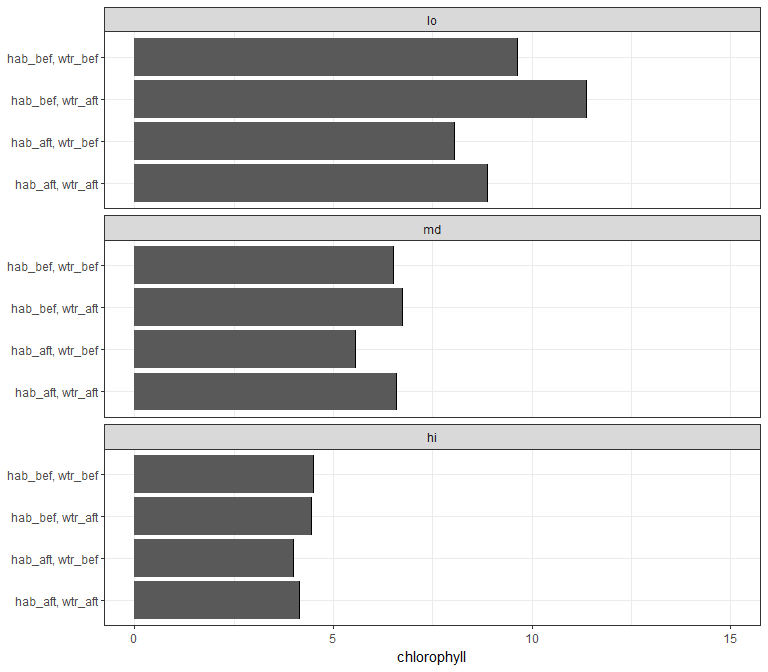<!-- -->


```r
# combine restoration locations, date, type
resgrp <- 'top'
restall <- left_join(restdat, reststat, by = 'id')
names(restall)[names(restall) %in% resgrp] <- 'Restoration\ngroup'

# map by restoration type
pbase +
  geom_point(data = restall, aes(x = lon, y = lat, fill = `Restoration\ngroup`), size = 4, pch = 21)
```

<!-- -->

```r
# map by date
pbase +
  geom_point(data = restall, aes(x = lon, y = lat, fill = factor(date)), size = 4, pch = 21)
```

<!-- -->

```r
# barplot of date counts
toplo <- restall %>% 
  group_by(date)
ggplot(restall, aes(x = factor(date))) + 
  geom_bar() + 
  coord_flip() + 
  theme_bw() + 
  theme(
    axis.title.y = element_blank()
  ) +
  scale_y_discrete(expand = c(0, 0))
```

<!-- -->

## Same locations, same dates, random project types


```r
# setup parallel
ncores <- detectCores() - 1
registerDoParallel(cores = ncores)
strt <- Sys.time()

# run
allchg_r1 <- foreach(i = 1:n, .packages = c('stringi', 'tidyr', 'dplyr', 'raster', 'sp', 'rgeos', 'tibble', 'rgdal', 'purrr', 'geosphere')) %dopar% {

  sink('log.txt')
  cat('Log entry time', as.character(Sys.time()), '\n')
  cat(i, ' of ', n, '\n')
  print(Sys.time() - strt)
  sink()
  
  # get random data
  rnd <- rnd_dat(restdat, reststat, tbpoly, loc = F, dts = F, prj = T)
  restdat_rnd <- rnd$restdat_rnd
  reststat_rnd <- rnd$reststat_rnd
  
  # run all conditional prob functions
  allchg <- get_all(restdat_rnd, reststat_rnd, wqdat, wqstat, mtch = mtch, yrdf = yrdf, resgrp = 'top', qts = c(0.33, 0.66), 
                    lbs = c('lo', 'md', 'hi'), 'hab', 'wtr')
  
  out <- allchg %>% 
    group_by(hab, wtr, salev) %>% 
    summarize(cval = mean(cval))
  
  out
  
}

save(allchg_r1, file = 'data/allchg_r1.RData', compress = 'xz')
```


```r
data(allchg_r1)

# summarize random
toplo <- allchg_r1 %>% 
  enframe('iter') %>% 
  unnest %>% 
  group_by(hab, wtr, salev) %>% 
  summarise(
    chvalmd = median(cval, na.rm = T), #t.test(cval, na.rm = T)$estimate,
    chvallo = quantile(cval, probs = 0.05, na.rm = T), # t.test(cval, na.rm = T),$conf.int[1],
    chvalhi = quantile(cval, probs = 0.95, na.rm = T) #t.test(cval, na.rm = T),$conf.int[2]
  ) %>% 
  ungroup %>% 
  unite('rest', hab, wtr, sep = ', ') %>% 
  mutate(
    salev = factor(salev, levels = c('lo', 'md', 'hi'))
  ) 

# plot
ggplot(toplo, aes(x = rest, y = chvalmd)) + 
  theme_bw() + 
  theme(
    axis.title.y = element_blank()
  ) +
  geom_bar(stat = 'identity') + 
  geom_errorbar(aes(ymin = chvallo, ymax = chvalhi)) + 
  facet_wrap( ~ salev, ncol = 1) + 
  coord_flip() +
  scale_y_continuous('chlorophyll', limits = c(0, 15))
```

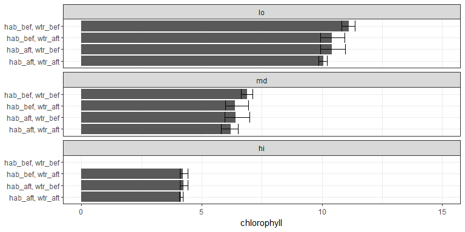<!-- -->


```r
# get random data
rnd <- rnd_dat(restdat, reststat, tbpoly, loc = F, dts = F, prj = T)
restdat_rnd <- rnd$restdat_rnd
reststat_rnd <- rnd$reststat_rnd

# combine restoration locations, date, type
resgrp <- 'top'
restall_rnd <- left_join(restdat_rnd, reststat_rnd, by = 'id')
names(restall_rnd)[names(restall_rnd) %in% resgrp] <- 'Restoration\ngroup'

# map by restoration type
pbase +
  geom_point(data = restall_rnd, aes(x = lon, y = lat, fill = `Restoration\ngroup`), size = 4, pch = 21)
```

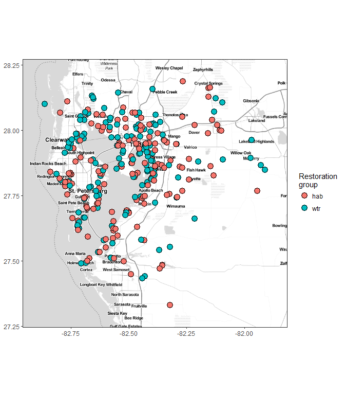<!-- -->

```r
# map by date
pbase +
  geom_point(data = restall_rnd, aes(x = lon, y = lat, fill = factor(date)), size = 4, pch = 21)
```

<!-- -->

```r
# barplot of date counts
toplo <- restall_rnd %>% 
  group_by(date)
ggplot(restall_rnd, aes(x = factor(date))) + 
  geom_bar() + 
  coord_flip() + 
  theme_bw() + 
  theme(
    axis.title.y = element_blank()
  ) +
  scale_y_discrete(expand = c(0, 0))
```

<!-- -->

## Same locations, random dates, random project types


```r
# setup parallel
ncores <- detectCores() - 1
registerDoParallel(cores = ncores)
strt <- Sys.time()

# run
allchg_r2 <- foreach(i = 1:n, .packages = c('stringi', 'tidyr', 'dplyr', 'raster', 'sp', 'rgeos', 'tibble', 'rgdal', 'purrr', 'geosphere')) %dopar% {

  sink('log.txt')
  cat('Log entry time', as.character(Sys.time()), '\n')
  cat(i, ' of ', n, '\n')
  print(Sys.time() - strt)
  sink()
  
  # random identifier, date range
  id <- stri_rand_strings(tot, 5)
  dts <- range(restdat$date)
  
  # random dates, project types
  restdat_rnd <- tibble(id) %>% 
    mutate(
      date = sample(seq(dts[1], dts[2]), tot, replace = T),
      top = sample(c('hab', 'wtr'), tot, replace = T)    
    )
  
  # same locations
  reststat_rnd <- tibble(id) %>% 
    mutate(
      lat = reststat$lat, 
      lon = reststat$lon
    )
  
  # run all conditional prob functions
  allchg <- get_all(restdat_rnd, reststat_rnd, wqdat, wqstat, mtch = mtch, yrdf = yrdf, resgrp = 'top', qts = c(0.33, 0.66), 
                    lbs = c('lo', 'md', 'hi'), 'hab', 'wtr')
  
  out <- allchg %>% 
    group_by(hab, wtr, salev) %>% 
    summarize(cval = mean(cval))
  
  out
  
}

save(allchg_r2, file = 'data/allchg_r2.RData', compress = 'xz')
```


```r
data(allchg_r2)

# summarize random
toplo <- allchg_r2 %>% 
  enframe('iter') %>% 
  unnest %>% 
  group_by(hab, wtr, salev) %>% 
  summarise(
    chvalmd = median(cval, na.rm = T), #t.test(cval, na.rm = T)$estimate,
    chvallo = quantile(cval, probs = 0.05, na.rm = T), # t.test(cval, na.rm = T),$conf.int[1],
    chvalhi = quantile(cval, probs = 0.95, na.rm = T) #t.test(cval, na.rm = T),$conf.int[2]
  ) %>% 
  ungroup %>% 
  unite('rest', hab, wtr, sep = ', ') %>% 
  mutate(
    salev = factor(salev, levels = c('lo', 'md', 'hi'))
  ) 

# plot
ggplot(toplo, aes(x = rest, y = chvalmd)) + 
  theme_bw() + 
  theme(
    axis.title.y = element_blank()
  ) +
  geom_bar(stat = 'identity') + 
  geom_errorbar(aes(ymin = chvallo, ymax = chvalhi)) + 
  facet_wrap( ~ salev, ncol = 1) + 
  coord_flip() +
  scale_y_continuous('chlorophyll', limits = c(0, 15))
```

<!-- -->


```r
# random identifier, date range
id <- stri_rand_strings(tot, 5)
dts <- range(restdat$date)

# random dates, project types
restdat_rnd <- tibble(id) %>% 
  mutate(
    date = sample(seq(dts[1], dts[2]), tot, replace = T),
    top = sample(c('hab', 'wtr'), tot, replace = T)    
  )

# same locations
reststat_rnd <- tibble(id) %>% 
  mutate(
    lat = reststat$lat, 
    lon = reststat$lon
  )

# combine restoration locations, date, type
resgrp <- 'top'
restall_rnd <- left_join(restdat_rnd, reststat_rnd, by = 'id')
names(restall_rnd)[names(restall_rnd) %in% resgrp] <- 'Restoration\ngroup'

# map by restoration type
pbase +
  geom_point(data = restall_rnd, aes(x = lon, y = lat, fill = `Restoration\ngroup`), size = 4, pch = 21)
```

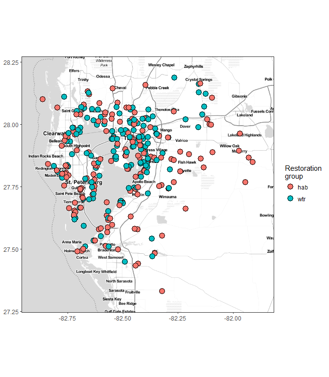<!-- -->

```r
# map by date
pbase +
  geom_point(data = restall_rnd, aes(x = lon, y = lat, fill = factor(date)), size = 4, pch = 21)
```

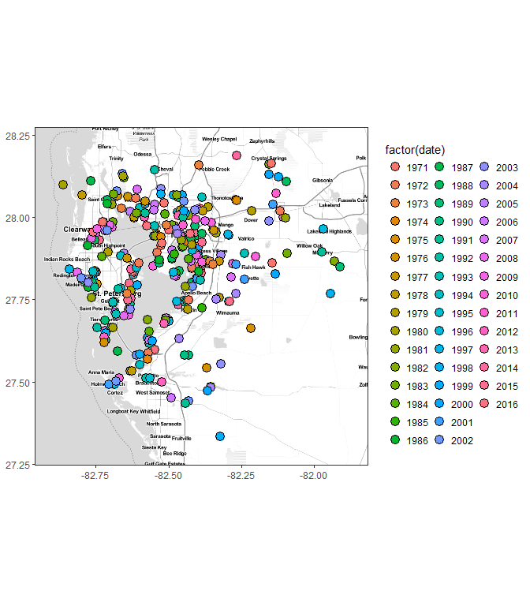<!-- -->

```r
# barplot of date counts
toplo <- restall_rnd %>% 
  group_by(date)
ggplot(restall_rnd, aes(x = factor(date))) + 
  geom_bar() + 
  coord_flip() + 
  theme_bw() + 
  theme(
    axis.title.y = element_blank()
  ) +
  scale_y_discrete(expand = c(0, 0))
```

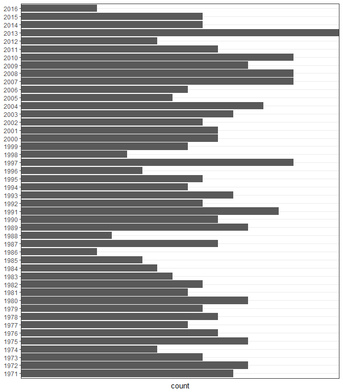<!-- -->

## Random locations, same dates, random project types


```r
# setup parallel
ncores <- detectCores() - 1
registerDoParallel(cores = ncores)
strt <- Sys.time()

# run
allchg_r3 <- foreach(i = 1:n, .packages = c('stringi', 'tidyr', 'dplyr', 'raster', 'sp', 'rgeos', 'tibble', 'rgdal', 'purrr', 'geosphere')) %dopar% {

  sink('log.txt')
  cat('Log entry time', as.character(Sys.time()), '\n')
  cat(i, ' of ', n, '\n')
  print(Sys.time() - strt)
  sink()
  
  # random identifier
  id <- stri_rand_strings(tot, 5)
  
  # total random sites to create
  tot <- nrow(restdat)
  
  lon <- runif(10 * tot, min(reststat$lon), max(reststat$lon))
  lat <- runif(10 * tot, min(reststat$lat), max(reststat$lat))
  tmp <- SpatialPoints(cbind(lon, lat), 
                       proj4string = crs(tbpoly)
  ) %>% 
    .[tbpoly, ] %>% 
    .[sample(1:nrow(.@coords), tot, replace = F), ]
  
  # random dates, project types
  restdat_rnd <- tibble(id) %>% 
    mutate(
      date = restdat$date,
      top = sample(c('hab', 'wtr'), tot, replace = T)    
    )
  
  # same locations
  reststat_rnd <- tibble(id) %>% 
    mutate(
      lat = tmp$lat, 
      lon = tmp$lon
    )
  
  # run all conditional prob functions
  allchg <- get_all(restdat_rnd, reststat_rnd, wqdat, wqstat, mtch = mtch, yrdf = yrdf, resgrp = 'top', qts = c(0.33, 0.66), 
                    lbs = c('lo', 'md', 'hi'), 'hab', 'wtr')
  
  out <- allchg %>% 
    group_by(hab, wtr, salev) %>% 
    summarize(cval = mean(cval))
  
  out
  
}

save(allchg_r3, file = 'data/allchg_r3.RData', compress = 'xz')
```


```r
data(allchg_r3)

# summarize random
toplo <- allchg_r3 %>% 
  enframe('iter') %>% 
  unnest %>% 
  group_by(hab, wtr, salev) %>% 
  summarise(
    chvalmd = median(cval, na.rm = T), #t.test(cval, na.rm = T)$estimate,
    chvallo = quantile(cval, probs = 0.05, na.rm = T), # t.test(cval, na.rm = T),$conf.int[1],
    chvalhi = quantile(cval, probs = 0.95, na.rm = T) #t.test(cval, na.rm = T),$conf.int[2]
  ) %>% 
  ungroup %>% 
  unite('rest', hab, wtr, sep = ', ') %>% 
  mutate(
    salev = factor(salev, levels = c('lo', 'md', 'hi'))
  ) 

# plot
ggplot(toplo, aes(x = rest, y = chvalmd)) + 
  theme_bw() + 
  theme(
    axis.title.y = element_blank()
  ) +
  geom_bar(stat = 'identity') + 
  geom_errorbar(aes(ymin = chvallo, ymax = chvalhi)) + 
  facet_wrap( ~ salev, ncol = 1) + 
  coord_flip() +
  scale_y_continuous('chlorophyll', limits = c(0, 15))
```

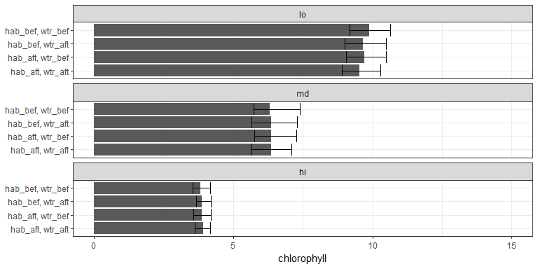<!-- -->


```r
# random identifier
id <- stri_rand_strings(tot, 5)

# total random sites to create
tot <- nrow(restdat)

lon <- runif(10 * tot, min(reststat$lon), max(reststat$lon))
lat <- runif(10 * tot, min(reststat$lat), max(reststat$lat))
tmp <- SpatialPoints(cbind(lon, lat), 
                     proj4string = crs(tbpoly)
) %>% 
  .[tbpoly, ] %>% 
  .[sample(1:nrow(.@coords), tot, replace = F), ]

# random dates, project types
restdat_rnd <- tibble(id) %>% 
  mutate(
    date = restdat$date,
    top = sample(c('hab', 'wtr'), tot, replace = T)    
  )

# same locations
reststat_rnd <- tibble(id) %>% 
  mutate(
    lat = tmp$lat, 
    lon = tmp$lon
  )

# combine restoration locations, date, type
resgrp <- 'top'
restall_rnd <- left_join(restdat_rnd, reststat_rnd, by = 'id')
names(restall_rnd)[names(restall_rnd) %in% resgrp] <- 'Restoration\ngroup'

# map by restoration type
pbase +
  geom_point(data = restall_rnd, aes(x = lon, y = lat, fill = `Restoration\ngroup`), size = 4, pch = 21)
```

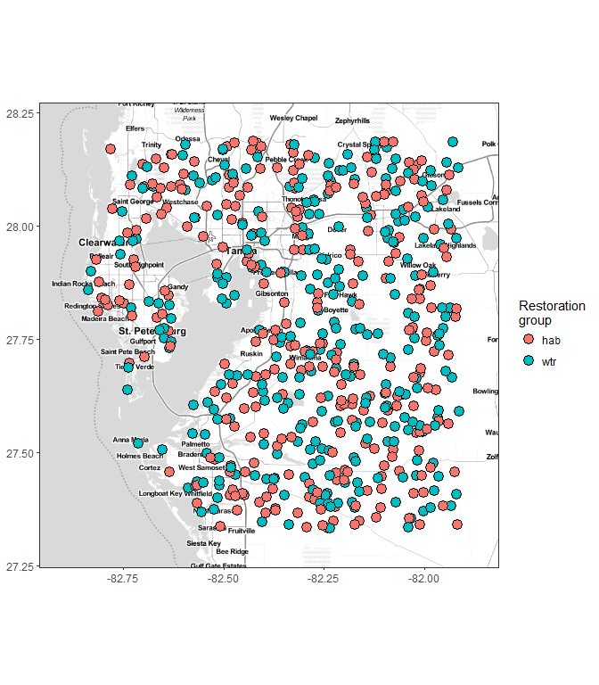<!-- -->

```r
# map by date
pbase +
  geom_point(data = restall_rnd, aes(x = lon, y = lat, fill = factor(date)), size = 4, pch = 21)
```

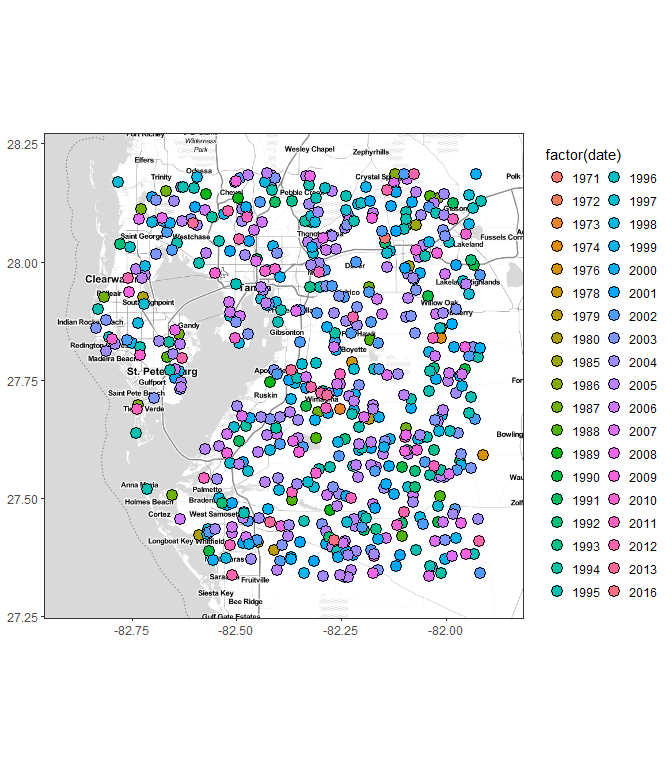<!-- -->

```r
# barplot of date counts
toplo <- restall_rnd %>% 
  group_by(date)
ggplot(restall_rnd, aes(x = factor(date))) + 
  geom_bar() + 
  coord_flip() + 
  theme_bw() + 
  theme(
    axis.title.y = element_blank()
  ) +
  scale_y_discrete(expand = c(0, 0))
```

<!-- -->

## Random locations, random dates, random project types


```r
# setup parallel
ncores <- detectCores() - 1
registerDoParallel(cores = ncores)
strt <- Sys.time()

# run
allchg_r4 <- foreach(i = 1:n, .packages = c('stringi', 'tidyr', 'dplyr', 'raster', 'sp', 'rgeos', 'tibble', 'rgdal', 'purrr', 'geosphere')) %dopar% {

  sink('log.txt')
  cat('Log entry time', as.character(Sys.time()), '\n')
  cat(i, ' of ', n, '\n')
  print(Sys.time() - strt)
  sink()
  
  # id values, date ranges
  id <- stri_rand_strings(tot, 5)
  dts <- range(restdat$date)
  
  lon <- runif(10 * tot, min(reststat$lon), max(reststat$lon))
  lat <- runif(10 * tot, min(reststat$lat), max(reststat$lat))
  tmp <- SpatialPoints(cbind(lon, lat), 
                       proj4string = crs(tbpoly)
  ) %>% 
    .[tbpoly, ] %>% 
    .[sample(1:nrow(.@coords), tot, replace = F), ]
  
  restdat_rnd <- tibble(id) %>% 
    mutate(
      date = sample(seq(dts[1], dts[2]), tot, replace = T),
      top = sample(c('hab', 'wtr'), tot, replace = T)    
    )
  
  reststat_rnd <- tibble(id) %>% 
    mutate(
      lat = tmp$lat, 
      lon = tmp$lon
    )
  
  # run all conditional prob functions
  allchg <- get_all(restdat_rnd, reststat_rnd, wqdat, wqstat, mtch = mtch, yrdf = yrdf, resgrp = 'top', qts = c(0.33, 0.66), 
                    lbs = c('lo', 'md', 'hi'), 'hab', 'wtr')
  
  out <- allchg %>% 
    group_by(hab, wtr, salev) %>% 
    summarize(cval = mean(cval))
  
  out
  
}

save(allchg_r4, file = 'data/allchg_r4.RData', compress = 'xz')
```


```r
data(allchg_r4)

# summarize random
toplo <- allchg_r4 %>% 
  enframe('iter') %>% 
  unnest %>% 
  group_by(hab, wtr, salev) %>% 
  summarise(
    chvalmd = median(cval, na.rm = T), #t.test(cval, na.rm = T)$estimate,
    chvallo = quantile(cval, probs = 0.05, na.rm = T), # t.test(cval, na.rm = T),$conf.int[1],
    chvalhi = quantile(cval, probs = 0.95, na.rm = T) #t.test(cval, na.rm = T),$conf.int[2]
  ) %>% 
  ungroup %>% 
  unite('rest', hab, wtr, sep = ', ') %>% 
  mutate(
    salev = factor(salev, levels = c('lo', 'md', 'hi'))
  ) 

# plot
ggplot(toplo, aes(x = rest, y = chvalmd)) + 
  theme_bw() + 
  theme(
    axis.title.y = element_blank()
  ) +
  geom_bar(stat = 'identity') + 
  geom_errorbar(aes(ymin = chvallo, ymax = chvalhi)) + 
  facet_wrap( ~ salev, ncol = 1) + 
  coord_flip() +
  scale_y_continuous('chlorophyll', limits = c(0, 15))
```

<!-- -->


```r
id <- stri_rand_strings(tot, 5)
dts <- range(restdat$date)

ext <- bbox(tbpoly)

lon <- runif(10 * tot, min(reststat$lon), max(reststat$lon))
lat <- runif(10 * tot, min(reststat$lat), max(reststat$lat))
tmp <- SpatialPoints(cbind(lon, lat), 
                     proj4string = crs(tbpoly)
) %>% 
  .[tbpoly, ] %>% 
  .[sample(1:nrow(.@coords), tot, replace = F), ]

restdat_rnd <- tibble(id) %>% 
  mutate(
    date = sample(seq(dts[1], dts[2]), tot, replace = T),
    top = sample(c('hab', 'wtr'), tot, replace = T)    
  )

reststat_rnd <- tibble(id) %>% 
  mutate(
    lat = tmp$lat, 
    lon = tmp$lon
  )

resgrp <- 'top'
restall_rnd <- left_join(restdat_rnd, reststat_rnd, by = 'id')
names(restall_rnd)[names(restall_rnd) %in% resgrp] <- 'Restoration\ngroup'

# map by restoration type
pbase +
  geom_point(data = restall_rnd, aes(x = lon, y = lat, fill = `Restoration\ngroup`), size = 4, pch = 21)
```

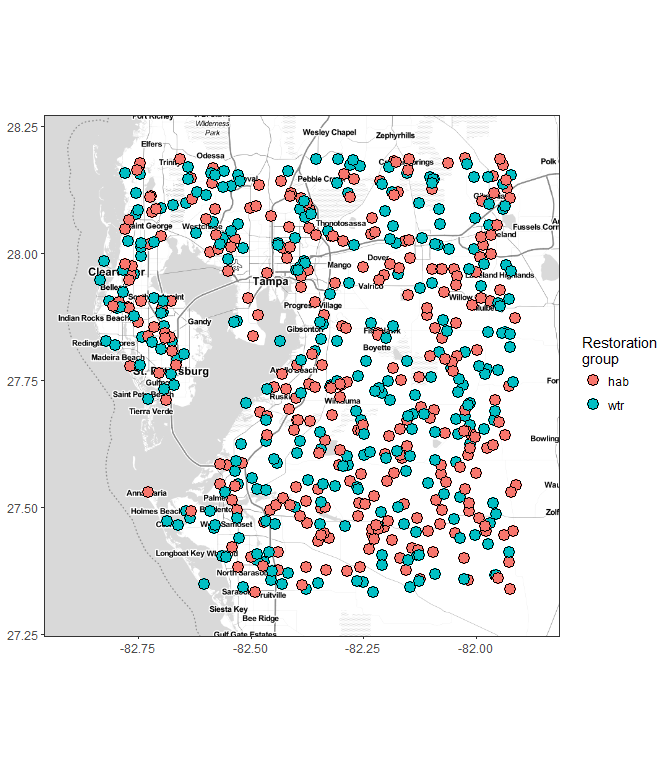<!-- -->

```r
# map by date
pbase +
  geom_point(data = restall_rnd, aes(x = lon, y = lat, fill = factor(date)), size = 4, pch = 21)
```

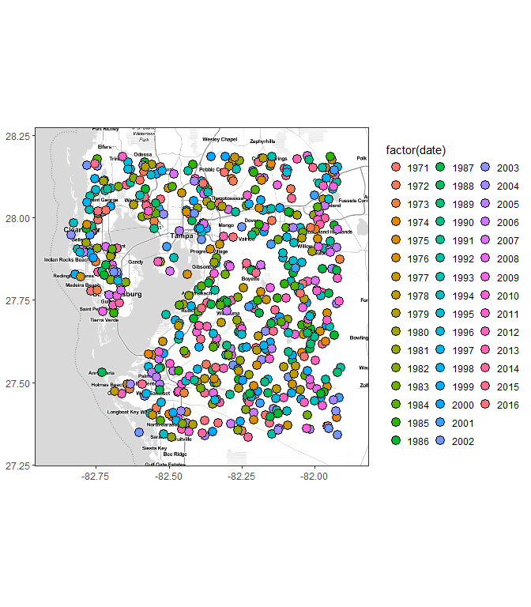<!-- -->

```r
# barplot of date counts
toplo <- restall_rnd %>% 
  group_by(date)
ggplot(restall_rnd, aes(x = factor(date))) + 
  geom_bar() + 
  coord_flip() + 
  theme_bw() + 
  theme(
    axis.title.y = element_blank()
  ) +
  scale_y_discrete(expand = c(0, 0))
```

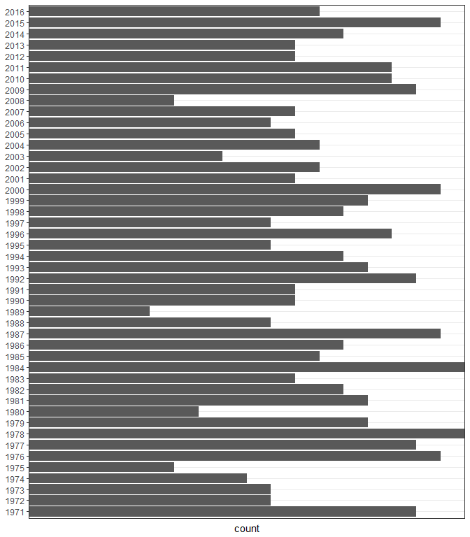<!-- -->

