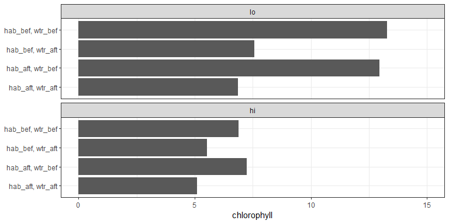
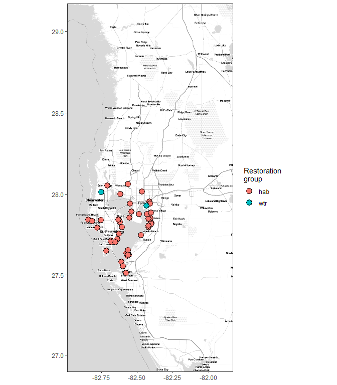
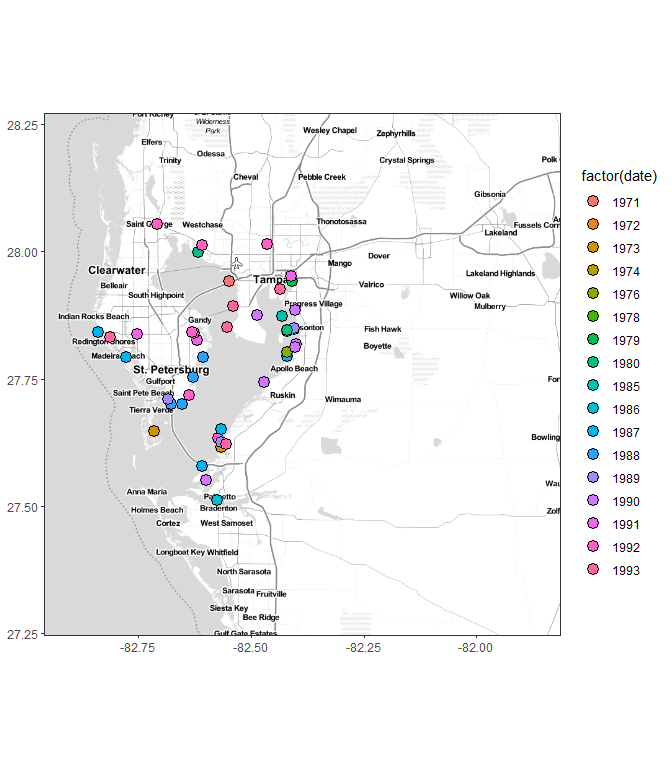
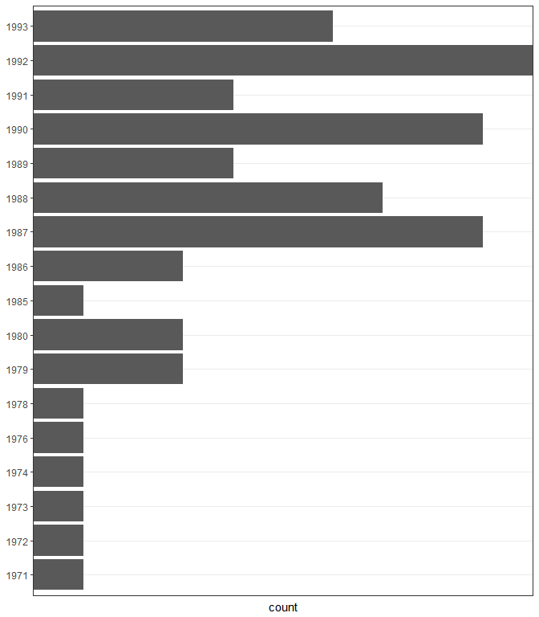
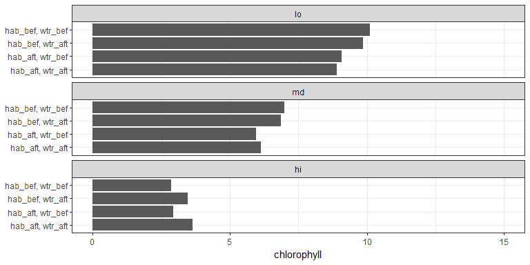
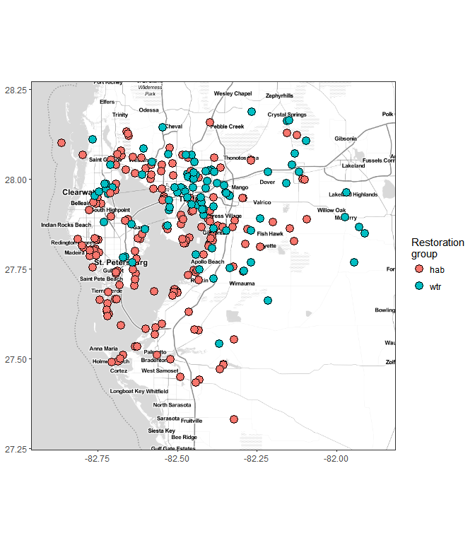
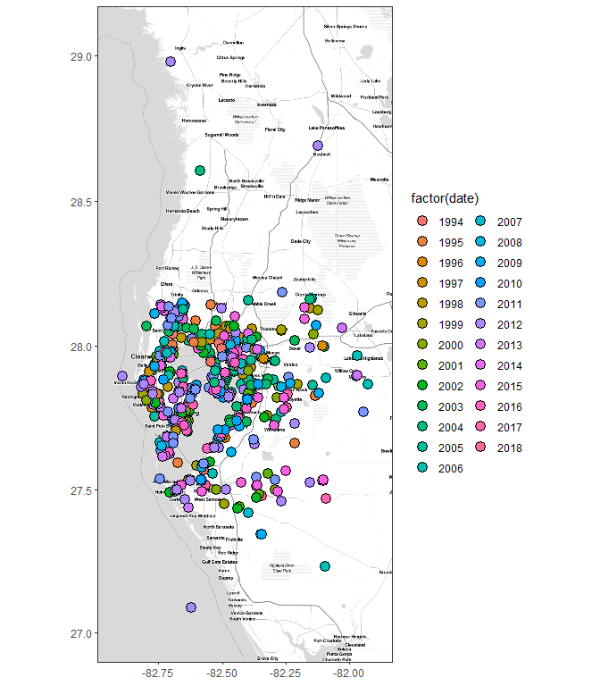
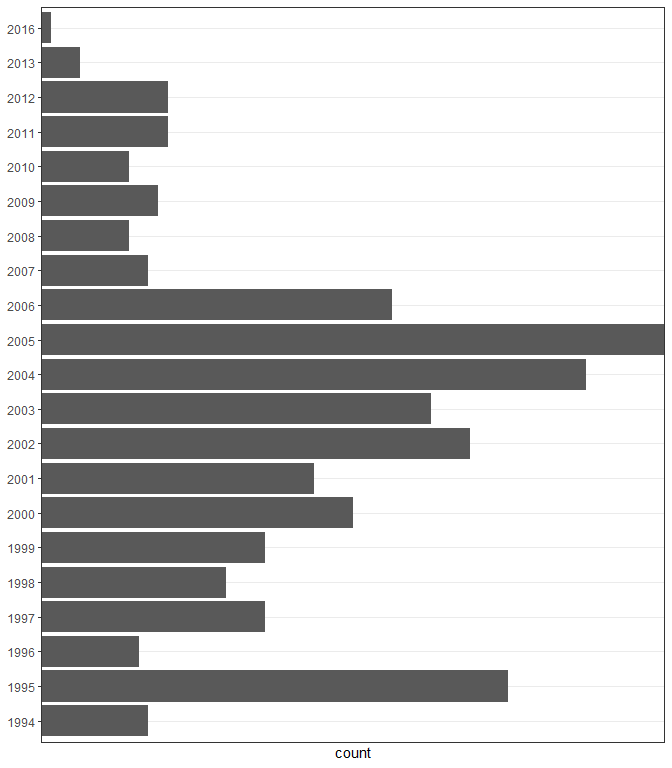
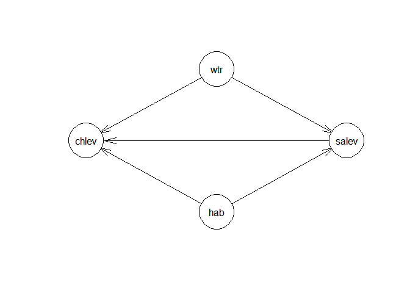
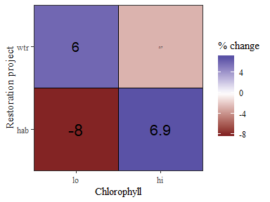

---
output:
  html_document:
    keep_md: yes
    code_folding: hide
toc: no
self_contained: no
---
  
# Evaluation of subset data{.tabset}

Matched to nearest two sites in each category, +/- five years.

```r
knitr::opts_chunk$set(message = F, warning = F)

library(tidyverse)
library(ggmap)
library(lubridate)
library(geosphere)
library(stringi)
library(tibble)
library(bnlearn)
library(sp)
library(sf)

data(restdat)
data(reststat)
data(wqdat)
data(wqstat)

# source R files
source('R/get_chg.R')
source('R/get_clo.R')
source('R/get_cdt.R')
source('R/get_brk.R')
source('R/get_fin.R')
source('R/get_all.R')
source('R/rnd_dat.R')

# globals
mtch <- 2
yrdf <- 5
resgrp <- 'top' 
qts <- c(0.5)
lbs <- c('lo', 'hi')

# base map
ext <- make_bbox(reststat$lon, reststat$lat, f = 0.1)
map <- get_stamenmap(ext, zoom = 10, maptype = "toner-lite")
pbase <- ggmap(map) +
  theme_bw() +
  theme(
    axis.title.x = element_blank(),
    axis.title.y = element_blank()
  )
```

## Pre-1994 data


```r
# get sub data, restoration sites
restdat_sub <- restdat %>% 
  filter(date < 1994)
reststat_sub <- reststat %>% 
  filter(id %in% restdat_sub$id)

# get conditional probability tables

## Distance to restoration sites
wqmtch <- get_clo(restdat_sub, reststat_sub, wqstat, resgrp = resgrp, mtch = mtch)

## Summarizing effects of restoration projects on salinity
sachg <- get_chg(wqdat, wqmtch, statdat, restdat, wqvar = 'sal', yrdf = yrdf) %>% 
  rename(saval = cval)

## Summarizing effects of restoration projects on chl
chchg <- get_chg(wqdat, wqmtch, statdat, restdat, wqvar = 'chla', yrdf = yrdf) %>% 
  rename(chval = cval)

# combine all using a super simple approach
cdat_pre <- sachg %>% 
  left_join(chchg, by = c('stat', 'hab', 'wtr')) %>% 
  mutate(
    salev = cut(saval, breaks = c(-Inf, quantile(saval, qts, na.rm = T), Inf), labels = lbs),
    chlev = cut(chval, breaks = c(-Inf, quantile(chval, qts, na.rm = T), Inf), labels = lbs)
  ) %>% 
  # dplyr::select(-saval, -nival, -chval, -stat) %>% 
  mutate_if(is.character, factor) %>% 
  data.frame

toplo <- cdat_pre %>% 
  group_by(hab, wtr, salev) %>% 
  summarize(
    chvalmd = mean(chval, na.rm = T)
    ) %>% 
  na.omit %>% 
  unite('rest', hab, wtr, sep = ', ')

# plot
ggplot(toplo, aes(x = rest, y = chvalmd)) + 
  theme_bw() + 
  theme(
    axis.title.y = element_blank()
  ) +
  geom_bar(stat = 'identity') +
  facet_wrap(~ salev, ncol = 1) + 
  coord_flip() +
  scale_y_continuous('chlorophyll', limits = c(0,15))
```

<!-- -->


```r
# combine restoration locations, date, type
resgrp <- 'top'
restall_sub <- left_join(restdat_sub, reststat_sub, by = 'id')
names(restall_sub)[names(restall_sub) %in% resgrp] <- 'Restoration\ngroup'

# map by restoration type
pbase +
  geom_point(data = restall_sub, aes(x = lon, y = lat, fill = `Restoration\ngroup`), size = 4, pch = 21)
```

<!-- -->

```r
# map by date
pbase +
  geom_point(data = restall_sub, aes(x = lon, y = lat, fill = factor(date)), size = 4, pch = 21)
```

<!-- -->

```r
# barplot of date counts
toplo <- restall_sub %>% 
  group_by(date)
ggplot(restall_sub, aes(x = factor(date))) + 
  geom_bar() + 
  coord_flip() + 
  theme_bw() + 
  theme(
    axis.title.y = element_blank()
  ) +
  scale_y_discrete(expand = c(0, 0))
```

<!-- -->


```r
cdat_pre_mod <- cdat_pre %>% 
  select_if(is.factor) %>% 
  na.omit %>% 
  data.frame

# create Network
net <- model2network("[hab][wtr][salev|hab:wtr][chlev|hab:wtr:salev]")
plot(net)
```

<!-- -->

```r
#Creating CPTs from data
fittedBN <- bn.fit(net, data = cdat_pre_mod)
fittedBN$chlev
```

```
## 
##   Parameters of node chlev (multinomial distribution)
## 
## Conditional probability table:
##  
## , , salev = lo, wtr = wtr_aft
## 
##      hab
## chlev   hab_aft   hab_bef
##    lo 1.0000000 0.5000000
##    hi 0.0000000 0.5000000
## 
## , , salev = hi, wtr = wtr_aft
## 
##      hab
## chlev   hab_aft   hab_bef
##    lo 0.7500000 0.7500000
##    hi 0.2500000 0.2500000
## 
## , , salev = lo, wtr = wtr_bef
## 
##      hab
## chlev   hab_aft   hab_bef
##    lo 0.2352941 0.1250000
##    hi 0.7647059 0.8750000
## 
## , , salev = hi, wtr = wtr_bef
## 
##      hab
## chlev   hab_aft   hab_bef
##    lo 0.6363636 0.7083333
##    hi 0.3636364 0.2916667
```

```r
#Get inferences
cpquery(fittedBN,
        event = (chlev == "hi"),
        evidence= (hab == "hab_aft" & wtr == 'wtr_aft')
        )
```

```
## [1] 0.1333333
```


```r
ests <- unique(cdat_pre_mod) %>% 
  mutate(est = NA)

for(i in 1:nrow(ests)){
  
  toest <- ests[i, ]
  est <- cpquery(fittedBN,
                 event = (chlev == toest$chlev),
                 evidence= (wtr == toest$wtr & hab == toest$hab & salev == toest$salev)
  )
  
  ests[i, 'est'] <- est
  
}

ggplot(ests, aes(x = salev, y = est, fill = chlev)) + 
  geom_bar(stat = 'identity', position = 'dodge') + 
  facet_wrap(hab ~ wtr) + 
  theme_bw()
```

<!-- -->

## Post-1994 data


```r
# get sub data, restoration sites
restdat_sub <- restdat %>% 
  filter(date >= 1994)
reststat_sub <- reststat %>% 
  filter(id %in% restdat_sub$id)

# get conditional probability tables

## Distance to restoration sites
wqmtch <- get_clo(restdat_sub, reststat_sub, wqstat, resgrp = resgrp, mtch = mtch)

## Summarizing effects of restoration projects on salinity
sachg <- get_chg(wqdat, wqmtch, statdat, restdat, wqvar = 'sal', yrdf = yrdf) %>% 
  rename(saval = cval)

## Summarizing effects of restoration projects on chl
chchg <- get_chg(wqdat, wqmtch, statdat, restdat, wqvar = 'chla', yrdf = yrdf) %>% 
  rename(chval = cval)

# combine all using a super simple approach
cdat_pst <- sachg %>% 
  left_join(chchg, by = c('stat', 'hab', 'wtr')) %>% 
  mutate(
    salev = cut(saval, breaks = c(-Inf, quantile(saval, qts, na.rm = T), Inf), labels = lbs),
    chlev = cut(chval, breaks = c(-Inf, quantile(chval, qts, na.rm = T), Inf), labels = lbs)
  ) %>% 
  # dplyr::select(-saval, -nival, -chval, -stat) %>% 
  mutate_if(is.character, factor) %>% 
  data.frame

toplo <- cdat_pst %>% 
  group_by(hab, wtr, salev) %>% 
  summarize(
    chvalmd = mean(chval, na.rm = T)
    ) %>% 
  na.omit %>% 
  unite('rest', hab, wtr, sep = ', ')

# plot
ggplot(toplo, aes(x = rest, y = chvalmd)) + 
  theme_bw() + 
  theme(
    axis.title.y = element_blank()
  ) +
  geom_bar(stat = 'identity') +
  facet_wrap(~ salev, ncol = 1) + 
  coord_flip() +
  scale_y_continuous('chlorophyll', limits = c(0,15))
```

<!-- -->


```r
# combine restoration locations, date, type
resgrp <- 'top'
restall_sub <- left_join(restdat_sub, reststat_sub, by = 'id')
names(restall_sub)[names(restall_sub) %in% resgrp] <- 'Restoration\ngroup'

# map by restoration type
pbase +
  geom_point(data = restall_sub, aes(x = lon, y = lat, fill = `Restoration\ngroup`), size = 4, pch = 21)
```

<!-- -->

```r
# map by date
pbase +
  geom_point(data = restall_sub, aes(x = lon, y = lat, fill = factor(date)), size = 4, pch = 21)
```

<!-- -->

```r
# barplot of date counts
toplo <- restall_sub %>% 
  group_by(date)
ggplot(restall_sub, aes(x = factor(date))) + 
  geom_bar() + 
  coord_flip() + 
  theme_bw() + 
  theme(
    axis.title.y = element_blank()
  ) +
  scale_y_discrete(expand = c(0, 0))
```

<!-- -->


```r
cdat_pst_mod <- cdat_pst %>% 
  select_if(is.factor) %>% 
  na.omit %>% 
  data.frame

# create Network
net <- model2network("[hab][wtr][salev|hab:wtr][chlev|hab:wtr:salev]")
plot(net)
```

<!-- -->

```r
#Creating CPTs from data
fittedBN <- bn.fit(net, data = cdat_pst_mod)
fittedBN$chlev
```

```
## 
##   Parameters of node chlev (multinomial distribution)
## 
## Conditional probability table:
##  
## , , salev = lo, wtr = wtr_aft
## 
##      hab
## chlev   hab_aft   hab_bef
##    lo 0.1333333 0.1250000
##    hi 0.8666667 0.8750000
## 
## , , salev = hi, wtr = wtr_aft
## 
##      hab
## chlev   hab_aft   hab_bef
##    lo 0.7692308 0.8125000
##    hi 0.2307692 0.1875000
## 
## , , salev = lo, wtr = wtr_bef
## 
##      hab
## chlev   hab_aft   hab_bef
##    lo 0.3809524 0.2000000
##    hi 0.6190476 0.8000000
## 
## , , salev = hi, wtr = wtr_bef
## 
##      hab
## chlev   hab_aft   hab_bef
##    lo 0.7857143 1.0000000
##    hi 0.2142857 0.0000000
```

```r
#Get inferences
cpquery(fittedBN,
        event = (chlev == "hi"),
        evidence= (hab == "hab_aft" & wtr == 'wtr_aft')
        )
```

```
## [1] 0.4564506
```


```r
ests <- unique(cdat_pst_mod) %>% 
  mutate(est = NA)

for(i in 1:nrow(ests)){
  
  toest <- ests[i, ]
  est <- cpquery(fittedBN,
                 event = (chlev == toest$chlev),
                 evidence= (wtr == toest$wtr & hab == toest$hab & salev == toest$salev)
  )
  
  ests[i, 'est'] <- est
  
}

ggplot(ests, aes(x = salev, y = est, fill = chlev)) + 
  geom_bar(stat = 'identity', position = 'dodge') + 
  facet_wrap(hab ~ wtr) + 
  theme_bw()
```

<!-- -->
